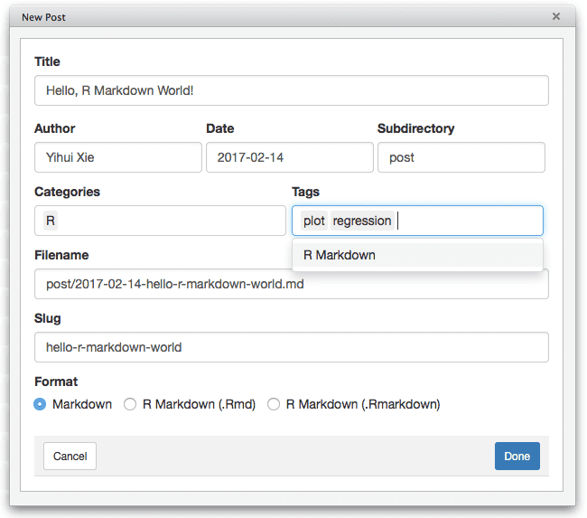
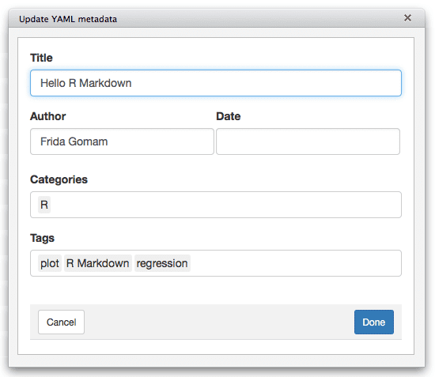
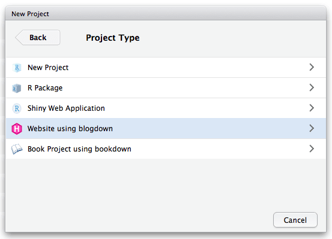

\mainmatter

# Comienzo

En este capítulo, mostramos cómo crear un sitio web simple desde cero. El sitio web contendrá una página de inicio, una página "Acerca de", una publicación de R Markdown y una publicación de markdown normal. Aprenderá los conceptos básicos para crear sitios web con **blogdown**. Para principiantes, le recomendamos que comience con RStudio IDE, pero realmente no es necesario. RStudio IDE puede facilitar algunas cosas, pero puede usar cualquier editor si no le importan los beneficios adicionales en RStudio.

## Instalación

Asumimos que ya ha instalado R (https://www.r-project.org) [@R-base] y RStudio IDE (https://www.rstudio.com). Si no tiene instalado RStudio IDE, instale Pandoc\index{Pandoc} (http://pandoc.org). A continuación, tenemos que instalar el paquete **blogdown** en R. Está disponible en CRAN y GitHub, y puede instalarlo con:


```{r eval=FALSE}
## Intalación desde el CRAN
install.packages('blogdown') 
## O, instalación desde GitHub
if (!requireNamespace("devtools")) install.packages('devtools')
devtools::install_github('rstudio/blogdown')
```

Como **blogdown** se basa en el generador de sitios estáticos Hugo (https://gohugo.io), también debe instalar Hugo\index{Hugo}. Hay una función auxiliar en **blogdown** para descargar e instalar automáticamente en los principales sistemas operativos (Windows, MacOS y Linux):


```{r eval=FALSE}
blogdown::install_hugo()
```

Por defecto, instala la última versión de Hugo, pero puede elegir una versión específica a través del argumento `versión`, si lo prefiere.

Para los usuarios de macOS, `install_hugo()` usa el administrador de paquetes Homebrew (https://brew.sh) si ya se ha instalado, de lo contrario solo descarga el binario de Hugo directamente.

### Actualización

Para actualizar o reinstalarHugo, use `blogdown::update_hugo()`, que es equivalente a `install_hugo(force = TRUE)`. Puede verificar la versión de Hugo instalada mediante `blogdown::hugo_version()`, y encontrar la última versión de Hugo en <https://github.com/gohugoio/hugo/releases>.

<!--
Para actualizar **blogdown**, use `update.packages()` o `install.packages('blogdown')`.
-->

## Un ejemplo rápido

Según nuestra experiencia, la documentación de Hugo puede ser un poco desalentadora para leer y digerir para principiantes.^[Un día Yihui estaba casi listo para suicidarme cuando intentaba averiguar cómo funciona `_index.md` leyendo la documentación una y otra vez, y buscando desesperadamente en el foro de Hugo.] Por ejemplo, su guía de "Inicio rápido" solía tener 12 pasos, y usted puede perderse fácilmente si no ha utilizado un generador de sitio web estático antes. Para **blogdown**, esperamos que los usuarios de todos los niveles al menos puedan comenzar lo más rápido posible. Hay muchas cosas que puede desear modificar para el sitio web más adelante, pero el primer paso es bastante simple: crear un nuevo proyecto en un directorio nuevo en RStudio IDE (`File -> New Project`) y llamar a la función en la consola de R del nuevo proyecto\index{blogdown::new\_site ()}:

```{r eval=FALSE}
blogdown::new_site()
```

Luego espere a que esta función cree un sitio nuevo, descargue el tema predeterminado, agregue algunas publicaciones de muestra, ábralas, cree el sitio y ejecútelo en RStudio Viewer, para que pueda obtener una vista previa de inmediato. Si no usa RStudio IDE, necesita asegurarse de que se encuentra actualmente en un directorio vacío,^[En R, compruebe la salida de `list.files('.')` y asegúrese de que no incluya archivos distintos a `LICENSE`, el archivo de proyecto de RStudio (`*.Rproj`), `README` o `README.md`.] en cuyo caso `new_site()` hará lo mismo, pero el sitio web se lanzará en su navegador web en lugar de RStudio Viewer.

Ahora debería ver un grupo de directorios y archivos en el proyecto RStudio o en su directorio de trabajo actual. Antes de explicar estos nuevos directorios y archivos, primero introduzcamos una tecnología importante y útil: _LiveReload._\index{LiveReload} Esto significa que su sitio web^[Hasta que configure su sitio web para ser implementado, LiveReload solo actualiza la versión *local* de su sitio web. Esta versión solo es visible para usted. Para que su sitio web pueda buscarse, descubrirse y vivir en Internet, tendrá que cargar los archivos de su sitio web en un creador de sitios. Consulte el capítulo \@ref(implementación) para obtener más detalles.] Se reconstruirá y volverá a cargar automáticamente en su navegador web^[También puede pensar en RStudio Viewer como un navegador web.] Cuando modifique cualquier archivo fuente de su sitio web y lo guarde. Básicamente, una vez que inicie el sitio web en un navegador web, ya no necesita volver a generarlo explícitamente. Todo lo que necesita hacer es editar los archivos fuente, como los documentos R Markdown, y guardarlos. No es necesario hacer clic en ningún botón ni ejecutar ningún comando. LiveReload se implementa a través de `blogdown::serve_site()`\index{blogdown::serve\_site()}, que está basado en el paquete de R **servr** [@R-servr] de manera predeterminada.^[Hugo tiene su propia implementación LiveReload. Si desea aprovecharlo, puede establecer la opción global `options(blogdown.generator.server = TRUE)`. Ver la sección\@ref(livereload) para más información.]

La función `new_site()` tiene varios argumentos, y puede revisar su página de ayuda de R (`?blogdown::new_site`) para más detalles. Un tema predeterminado mínimo llamado "hugo-lithium-theme" se proporciona como el tema predeterminado del nuevo sitio,^[Puede encontrar su código fuente en GitHub: https://github.com/yihui/hugo-lithium-theme. Este tema se bifurcó de https://github.com/jrutheiser/hugo-lithium-theme y se modificó para que funcione mejor con **blogdown**.] Y se puede ver cómo se ve en Figure \@ref(fig:lithium).

```{r lithium, fig.cap='La página de inicio del nuevo sitio por defecto.', echo=FALSE, fig.align='center', out.width='90%'}
knitr::include_graphics('images/lithium-theme.png')
```

Tiene que saber tres conceptos más básicos para un sitio web basado en Hugo:

1. El archivo de configuración `config.toml`\index{config.toml}, en el que puede especificar algunas configuraciones globales para su sitio. Incluso si no sabe qué es TOML en este momento (se presentará en el capítulo \@ref(hugo)), aún podrá cambiar algunas configuraciones obvias. Por ejemplo, puede ver configuraciones como estas en `config.toml`:

    ```js
    baseurl = "/"
    languageCode = "en-us"
    title = "A Hugo website"
    theme = "hugo-lithium-theme"

    [[menu.main]]
        name = "About"
        url = "/about/"
    [[menu.main]]
        name = "GitHub"
        url = "https://github.com/rstudio/blogdown"
    [[menu.main]]
        name = "Twitter"
        url = "https://twitter.com/rstudio"
    ```

    Puede cambiar el título de la página web, e.g., `title = "Mi propia página web chévere"`, y actualizar las URL de GitHub y Twitter.\index{Directories}

1. El directorio de contenido (por defecto, `content/`). Aquí es donde usted escribe los archivos de origen R Markdown o Markdown para sus publicaciones y páginas. Bajo `content/` del sitio predeterminado, puede ver `about.md` y un directorio` post/` que contiene algunas publicaciones. La organización del directorio de contenido depende de usted. Puede tener archivos y directorios arbitrarios allí, según la estructura del sitio web que desee.

1. El directorio de publicación (por defecto, `public/`). Su sitio web se generará en este directorio, lo que significa que no necesita agregar manualmente ningún archivo a este directorio.^[Ejecutando `serve_site()` o `build_site()`, los archivos se generarán y publicarán en su directorio de publicación automáticamente.] Por lo general, contiene una gran cantidad de archivos `*.html` y dependencias como `*.css`, `*.js` e imágenes. Puede cargar todo en `public/` a cualquier servidor web que pueda publicar sitios web estáticos, y su sitio web estará en funcionamiento. Hay muchas opciones para publicar sitios web estáticos, y hablaremos más sobre ellos en el capítulo \@ref(implementación) si no está familiarizado con la implementación de sitios web.

Si está satisfecho con este tema predeterminado, ¡está básicamente listo para comenzar a escribir y publicar su nuevo sitio web! Mostraremos cómo usar otros temas en la sección \@ref(otros-temas). Sin embargo, tenga en cuenta que un tema más complicado y elegante puede requerir que aprenda más sobre todas las tecnologías subyacentes, como el lenguaje de plantillas de Hugo, HTML, CSS y JavaScript.

## RStudio IDE

Hay algunos complementos básicos de RStudio\index{Complementos de RStudio} para facilitar la edición y la vista previa de su sitio web, y puede encontrarlos en el menú "Addins" en la barra de herramientas de RStudio:

- "Serve Site": este complemento llama a `blogdown::serve_site()` para presentar continuamente su sitio web localmente utilizando la tecnología LiveReload, para que pueda ver en vivo el sitio web. Puede seguir editando material para su sitio mientras lo está viendo, pero esta función bloqueará su consola de R de manera predeterminada, lo que significa que no podrá usar su consola de R una vez que inicie este servidor web local. Para desbloquear la consola, haga clic en el signo de stop rojo en la esquina superior derecha de la ventana de la consola. Si prefiere evitar este comportamiento por completo, establezca la opción `options(servr.daemon = TRUE)`, antes de hacer clic en este complemento o llame a la función `serve_site()`, para que el servidor sea demonizado y no bloquee su consola de R.^ [Hemos oído de casos en los que el servidor demonizado bloquea R en Windows. Si tiene problemas con el servidor daemonizado, existen tres soluciones alternativas, y puede probar una de ellas: (1) instalar el paquete **later** a través de `install.packages("later")` y volver a iniciar el servidor; (2) use el servidor de Hugo (vea la sección \@ref(livereload)); (3) llame `blogdown::serve_site()` en una sesión de R separada, y puede obtener una vista previa de su sitio web en su navegador web, pero aún puede editar el sitio web en RStudio.]

- "New Post": This addin provides a dialog box for you to enter the metadata of your blog post, including the title, author, date, and so on. See Figure \@ref(fig:new-post) for an example. This addin actually calls the function `blogdown::new_post()` under the hood, but does a few things automatically:

    - As you type the title of the post, it will generate a filename for you, and you can edit it if you do not like the automatically generated one. In fact, you can also use this addin to create normal pages under any directories under `content/`. For example, if you want to add a resume page, you can change the filename to `resume.md` from the default `post/YYYY-mm-dd-resume.md`.

    - You can select the date from a calendar widget provided by Shiny.^[Shiny is an R package for building interactive web apps using R. Using this addin, the calendar widget allows you to view an interactive calendar by month to select dates. This is a simple use of Shiny, but you can read more about Shiny apps here: https://shiny.rstudio.com.]

    - It will scan the categories and tags of existing posts, so when you want to input categories or tags, you can select them from the dropdown menus, or create new ones.
    
    - After a new post is created, it will be automatically opened, so you can start writing the content immediately.

- "Update Metadata": This addin allows you to update the YAML metadata of the currently opened post. See Figure \@ref(fig:update-meta) for an example. The main advantage of this addin is that you can select categories and tags from dropdown menus instead of having to remember them.

```{r new-post, fig.cap='Create a new post using the RStudio addin.', fig.align='center', out.width='80%', echo=FALSE}

```

```{r update-meta, fig.cap='Update the metadata of an existing post using the RStudio addin.', fig.align='center', out.width='70%', echo=FALSE}

```

With these addins, you should rarely need to run any R commands manually after you have set up your website, since all your posts will be automatically compiled whenever you create a new post or modify an existing post due to the LiveReload feature.

If your RStudio version is at least v1.1.383,^[You may download all RStudio official releases including v1.1.383 from <https://www.rstudio.com/products/rstudio/download/>.] you can actually create a website project directly from the menu `File -> New Project -> New Directory` (see Figure \@ref(fig:new-project) and \@ref(fig:blogdown-project)).

```{r new-project, echo=FALSE, fig.cap='Create a new website project in RStudio.', out.width='80%', fig.align='center'}

```

```{r blogdown-project, echo=FALSE, fig.cap='Create a website project based on blogdown.', out.width='80%', fig.align='center'}
knitr::include_graphics('images/blogdown-project.png')
```

If your website was created using the function `blogdown::new_site()` instead of the RStudio menu for the first time, you can quit RStudio and open the project again. If you go to the menu `Tools -> Project Options`, your project type should be "Website" like what you can see in Figure \@ref(fig:project-options).

Then you will see a pane in RStudio named "Build," and there is a button "Build Website." When you click this button, RStudio will call `blogdown::build_site()` to build the website. This will automatically generate files in the `public/` directory.^[Or wherever your publishing directory is located. It is `public/` by default, but it can be changed by specifying the `publishDir = "myNewDirectory"` in the `config.toml` file.] If you want to build the website and publish the output files under the `public/` manually, you are recommended to restart your R session and click this "Build Website" button every time before you publish the website, instead of publishing the `public/` folder generated continuously and automatically by `blogdown::serve_site()`, because the latter calls `blogdown::build_site(local = TRUE)`, which has some subtle differences with `blogdown::build_site(local = FALSE)` (see Section \@ref(local-preview) for details).

We strongly recommend that you uncheck the option "Preview site after building" in your RStudio project options (Figure \@ref(fig:project-options)).^[In case you wonder why: unless you have set the option `relativeurls` to `true` in `config.toml`, it requires a web server to preview the website locally, otherwise even if you can see the homepage of your website in the RStudio Viewer, most links like those links to CSS and JavaScript files are unlikely to work. When the RStudio Viewer shows you the preview, it does not actually launch a web server.] You can also uncheck the option "Re-knit current preview when supporting files change," since this option is not really useful after you call `serve_site()`.

```{r project-options, echo=FALSE, fig.cap='RStudio project options.', out.width='80%', fig.align='center'}
knitr::include_graphics('images/project-options.png')
```

## Global options\index{Global Options}

Depending on your personal preferences, you can set a few global options before you work on your website. These options should be set using `options(name = value)`, and currently available options are presented in Table \@ref(tab:global-options).

```{r global-options, echo=FALSE}
knitr::kable(matrix(c(
  'servr.daemon', 'FALSE', 'Whether to use a daemonized server',
  'blogdown.author', '', 'The default author of new posts',
  'blogdown.ext', '.md', 'Default extension of new posts',
  'blogdown.subdir', 'post', 'A subdirectory under content/',
  'blogdown.yaml.empty', TRUE, 'Preserve empty fields in YAML?',
  NULL
), ncol = 3, byrow = TRUE, dimnames = list(NULL, c('Option name', 'Default', 'Meaning'))), booktabs = TRUE, caption = 'Global options that affect the behavior of blogdown.')
```

We recommend that you set these options in your R startup profile file. You can check out the help page `?Rprofile` for more details, and here is a simplified introduction. A startup profile file is basically an R script that is executed when your R session is started. This is a perfect place to set global options, so you do not need to type these options again every time you start a new R session. You can use a global profile file `~/.Rprofile`,^[The tilde `~` denotes your home directory in your system.] or a per-project file `.Rprofile` under the root directory of your RStudio project. The former will be applied to all R sessions that you start, unless you have provided the latter to override it. The easiest way to create such a file is to use `file.edit()` in RStudio, e.g.,

```{r eval=FALSE}
file.edit('~/.Rprofile')
# or file.edit('.Rprofile')
```

Suppose you always prefer the daemonized server and want the author of new posts to be "John Doe" by default. You can set these options in the profile file:

```{r eval=FALSE}
options(servr.daemon = TRUE, blogdown.author = 'John Doe')
```

A nice consequence of setting these options is that when you use the RStudio addin "New Post," the fields "Author," "Subdirectory," and "Format" will be automatically populated, so you do not need to manipulate them every time unless you want to change the defaults (occasionally).

R only reads one startup profile file. For example, if you have a `.Rprofile` under the current directory and a global `~/.Rprofile`, only the former one will be executed when R starts up from the current directory. This may make it inconvenient for multiple authors collaborating on the same website project, since you cannot set author-specific options. In particular, it is not possible to set the `blogdown.author` option in a single `.Rprofile`, because this option should be different for different authors. One workaround is to set common options in `.Rprofile` under the root directory of the website project, and also execute the global `~/.Rprofile` if it exists. Author-specific options can be set in the global `~/.Rprofile` on each author's computer.

```{r eval=FALSE}
# in .Rprofile of the website project
if (file.exists('~/.Rprofile')) {
  base::sys.source('~/.Rprofile', envir = environment())
}
# then set options(blogdown.author = 'Your Name') in ~/.Rprofile
```

## R Markdown vs. Markdown {#output-format}

If you are not familiar with R Markdown\index{R Markdown}, please see Appendix \@ref(r-markdown) for a quick tutorial. When you create a new post, you have to decide whether you want to use R Markdown or plain Markdown\index{Markdown}, as you can see from Figure \@ref(fig:new-post). The main differences are:

1. You cannot execute any R code in a plain Markdown document, whereas in an R Markdown document, you can embed R code chunks (```` ```{r} ````). However, you can still embed R code in plain Markdown using the syntax for fenced code blocks ```` ```r ```` (note there are no curly braces `{}`). Such code blocks will not be executed and may be suitable for pure demonstration purposes. Below is an example of an R code chunk in R Markdown:


    ````markdown
    `r ''````{r cool-plot, fig.width='80%', fig.cap='A cool plot.'}
    plot(cars, pch = 20)  # not really cool
    ```
    ````
    
    And here is an example of an R code block in plain Markdown:
    
    ````markdown
    ```r
    1 + 1  # not executed
    ```
    ````


2. A plain Markdown post is rendered to HTML through [Blackfriday](https://gohugo.io/overview/configuration/) \index{Blackfriday}(a package written in the Go language and adopted by Hugo). An R Markdown document is compiled through the packages **rmarkdown**, **bookdown**, and Pandoc\index{Pandoc}, which means you can use most features of [Pandoc's Markdown](http://pandoc.org/MANUAL.html#pandocs-markdown) and [**bookdown**'s Markdown extensions](https://bookdown.org/yihui/bookdown/components.html) in **blogdown**. If you use R Markdown [@R-rmarkdown] with **blogdown**, we recommend that you read the documentation of Pandoc and **bookdown** at least once to know all the possible features. We will not repeat the details in this book, but list the features briefly below, which are also demonstrated on the example website https://blogdown-demo.rbind.io.

    - Inline formatting: `_italic_` / `**bold**` text and `` `inline code` ``.
    
    - Inline elements: subscripts (e.g., `H~2~0`) and superscripts (e.g., `R^2^`); links (`[text](url)`) and images ``; footnotes `text^[footnote]`.
    
    - Block-level elements: paragraphs; numbered and unnumbered section headers; ordered and unordered lists; block quotations; fenced code blocks; tables; horizontal rules.
    
    - Math expressions and equations.
    
    - Theorems and proofs.
    
    - R code blocks that can be used to produce text output (including tables) and graphics. Note that equations, theorems, tables, and figures can be numbered and cross-referenced.
    
    - Citations and bibliography.
    
    - HTML widgets, and Shiny apps embedded via `<iframe>`.

There are many differences in syntax between Blackfriday's Markdown and Pandoc's Markdown. For example, you can write a task list with Blackfriday but not with Pandoc:

```markdown
- [x] Write an R package.
- [ ] Write a book.
- [ ] ...
- [ ] Profit!
```


Similarly, Blackfriday does not support LaTeX math and Pandoc does. We have added the [MathJax](https://www.mathjax.org/#docs) \index{MathJax} support to the default theme ([hugo-lithium-theme](https://github.com/yihui/hugo-lithium-theme)) in **blogdown** to render LaTeX math on HTML pages, but there is a caveat for plain Markdown posts: you have to include inline math expressions in a pair of backticks `` `$math$` ``, e.g., `` `$S_n = \sum_{i=1}^n X_i$` ``. Similarly, math expressions of the display style have to be written in `` `$$math$$` ``. For R Markdown posts, you can use `$math$` for inline math expressions, and `$$math$$` for display-style expressions.^[The reason that we need the backticks for plain Markdown documents is that we have to prevent the LaTeX code from being interpreted as Markdown by Blackfriday. Backticks will make sure the inner content is not translated as Markdown to HTML, e.g., `` `$$x *y* z$$` `` will be converted to `<code>$$x *y* z$$</code>`. Without the backticks, it will be converted to `$$x <em>y</em> z$$`, which is not a valid LaTeX math expression for MathJax. Similar issues can arise when you have other special characters like underscores in your math expressions.]

If you find it is a pain to have to remember the differences between R Markdown and Markdown, a conservative choice is to always use R Markdown, even if your document does not contain any R code chunks. Pandoc's Markdown is much richer than Blackfriday, and there are only a small number of features unavailable in Pandoc but present in Blackfriday. The main disadvantages of using R Markdown are:

1. You may sacrifice some speed in rendering the website, but this may not be noticeable due to a caching mechanism in **blogdown** (more on this in Section \@ref(local-preview)). Hugo is very fast when processing plain Markdown files, and typically it should take less than one second to render a few hundred Markdown files.

1. You will have some intermediate HTML files in the source directory of your website, because **blogdown** has to call **rmarkdown** to pre-render `*.Rmd` files `*.html`. You will also have intermediate folders for figures (`*_files/`) and cache (`*_cache/`) if you have plot output in R code chunks or have enabled **knitr**'s caching. Unless you care a lot about the "cleanness" of the source repository of your website (especially when you use a version control tool like GIT), these intermediate files should not matter.

In this book, we usually mean `.Rmd` files when we say "R Markdown documents," which are compiled to `.html` by default. However, there is another type of R Markdown document with the filename extension `.Rmarkdown`. Such R Markdown documents are compiled to Markdown documents with the extension `.markdown`, which will be processed by Hugo instead of Pandoc. There are two major limitations of using `.Rmarkdown` compared to `.Rmd`:

- You cannot use Markdown features only supported by Pandoc, such as citations. Math expressions only work if you have installed the **xaringan** package [@R-xaringan] and applied the JavaScript solution mentioned in Section \@ref(javascript).

- HTML widgets are not supported.

The main advantage of using `.Rmarkdown` is that the output files are cleaner because they are Markdown files. It can be easier for you to read the output of your posts without looking at the actual web pages rendered. This can be particularly helpful when reviewing GitHub pull requests. Note that numbered tables, figures, equations, and theorems are also supported. You cannot directly use Markdown syntax in table or figure captions, but you can use text references as a workaround (see **bookdown**'s documentation).

For any R Markdown documents (not specific to **blogdown**), you have to specify an output format. There are many [possible output formats](http://rmarkdown.rstudio.com/lesson-9.html) in the **rmarkdown** package (such as `html_document` and `pdf_document`) and other extension packages (such as `tufte::tufte_html` and `bookdown::gitbook`). Of course, the output format for websites should be HTML. We have provided an output format function `blogdown::html_page` in **blogdown**, and all R Markdown files are rendered using this format. It is based on the output format `bookdown::html_document2`, which means it has inherited a lot of features from **bookdown** in addition to features in Pandoc. For example, you can number and cross-reference math equations, figures, tables, and theorems, etc. See Chapter 2 of the **bookdown** book [@xie2016] for more details on the syntax.

Note that the output format `bookdown::html_document2` in turn inherits from `rmarkdown::html_document`, so you need to see the help page `?rmarkdown::html_document` for all possible options for the format `blogdown::html_page`. If you want to change the default values of the options of this output format, you can add an `output` field to your YAML metadata. For example, we can add a table of contents to a page, set the figure width to be 6 inches, and use the `svg` device for plots by setting these options in YAML:

```yaml
---
title: "My Awesome Post"
author: "John Doe"
date: "2017-02-14"
output:
  blogdown::html_page:
    toc: true
    fig_width: 6
    dev: "svg"
---
```

To set options for `blogdown::html_page()` globally (i.e., apply certain options to all Rmd files), you can create a `_output.yml` file under the root directory of your website. This YAML file should contain the output format directly (do not put the output format under the `output` option), e.g.,

```yaml
blogdown::html_page:
  toc: true
  fig_width: 6
  dev: "svg"
```

At the moment, not all features of `rmarkdown::html_document` are supported in **blogdown**, such as `df_print`, `code_folding`, `code_download`, and so on.

If your code chunk has graphics output, we recommend that you avoid special characters like spaces in the chunk label. Ideally, you should only use alphanumeric characters and dashes, e.g., ```` ```{r, my-label}```` instead of ```` ```{r, my label}````.

It is not recommended to change the **knitr** chunk options `fig.path` or `cache.path` in R Markdown. The default values of these options work best with **blogdown**. Please read Section \@ref(dep-path) to know the technical reasons if you prefer.

If you are working on an R Markdown post, but do not want **blogdown** to compile it, you can temporarily change its filename extension from `.Rmd` to another unknown extension such as `.Rmkd`.

## Other themes

In Hugo, themes\index{Themes} control the entire appearance and functionality of your site. So, if you care a lot about the appearance of your website, you will probably spend quite a bit of time in the beginning looking for a Hugo theme that you like from the collection listed at http://themes.gohugo.io. Please note that not all themes have been tested against **blogdown**. If you find a certain theme does not work well with **blogdown**, you may report to https://github.com/rstudio/blogdown/issues, and we will try to investigate the reason, but it can be time-consuming to learn and understand how a new theme works, so we recommend that you learn more about Hugo by yourself before asking, and we also encourage users to help each other there.

After you have found a satisfactory theme, you need to figure out its GitHub username and repository name,^[For most themes, you can find this by navigating to the theme of your choice from http://themes.gohugo.io and then clicking on `Homepage`.] then either install the theme via\index{blogdown::install\_theme()} `blogdown::install_theme()`, or just create a new site under another new directory and pass the GitHub repository name to the `theme` argument of `new_site()`. We recommend that you use the second approach, because Hugo themes could be very complicated and the usage of each theme can be very different and highly dependent on `config.toml`. If you install a theme using `install_theme()` instead of `new_site()` you’ll need to manually create the `config.toml` file in the root directory of your website to match the newly installed theme.^[In a workaround, if you used `install_theme()` and set the `theme_example` argument to TRUE, then you can access an example `config.toml` file. In the `themes/` directory, navigate to the file for your newly downloaded theme and find `exampleSite/config.toml`. This file can be copied to your root directory (to replace the `config.toml` file from your original theme) or used as a template to correctly write a new `config.toml` file for your new theme.]

```{r eval=FALSE}
# for example, create a new site with the academic theme
blogdown::new_site(theme = 'gcushen/hugo-academic')
```

To save you some time, we list a few themes below that match our taste:

- Simple/minimal themes: [XMin,](https://github.com/yihui/hugo-xmin) [Tanka,](https://github.com/road2stat/hugo-tanka) [simple-a,](https://github.com/AlexFinn/simple-a) and [ghostwriter.](https://github.com/jbub/ghostwriter)

- Sophisticated themes: [hugo-academic](https://github.com/gcushen/hugo-academic) (strongly recommended for users in academia), [hugo-tranquilpeak-theme,](https://github.com/kakawait/hugo-tranquilpeak-theme) [hugo-creative-portfolio-theme,](https://github.com/kishaningithub/hugo-creative-portfolio-theme) and [hugo-universal-theme.](https://github.com/devcows/hugo-universal-theme)

- Multimedia content themes: If you are interested in adding multimedia content to your site (such as audio files of a podcast), the [castanet](https://github.com/mattstratton/castanet) theme provides an excellent framework tailored for this application.  An example of a site using **blogdown** with the castanet theme is the [R-Podcast.](https://www.r-podcast.org)

If you do not understand HTML, CSS, or JavaScript, and have no experience with Hugo themes or templates, it may take you about 10 minutes to get started with your new website, since you have to accept everything you are given (such as the default theme); if you do have the knowledge and experience (and desire to highly customize your site), it may take you several days to get started. Hugo is really powerful. Be cautious with power.

Another thing to keep in mind is that the more effort you make in a complicated theme, the more difficult it is to switch to other themes in the future, because you may have customized a lot of things that are not straightforward to port to another theme. So please ask yourself seriously, "Do I like this fancy theme so much that I will definitely not change it in the next couple of years?"

> If you choose to dig a rather deep hole, someday you will have no choice but keep on digging, even with tears.
>
> --- Liyun Chen^[Translated from her Chinese Weibo: http://weibo.com/1406511850/Dhrb4toHc (you cannot view this page unless you have logged in).]

## A recommended workflow {#workflow}

There are a lot of ways to start building a website and deploy it. Because of the sheer number of technologies that you need to learn to fully understand how a website works, we'd like to recommend one workflow to beginners, so that hopefully they do not need to digest the rest of this book. This is definitely not the most optimal workflow, but requires you to know the fewest technical details.

To start a new website:

1. Carefully pick a theme at http://themes.gohugo.io, and find the link to its GitHub repository, which is of the form `https://github.com/user/repo`.

1. Create a new project in RStudio, and type the code `blogdown::new_site(theme = 'user/repo')` in the R console, where `user/repo` is from the link in Step 1.

1. Play with the new site for a while and if you do not like it, you can repeat the above steps, otherwise edit the options in `config.toml`. If you do not understand certain options, go to the documentation of the theme, which is often the README page of the GitHub repository. Not all options have to be changed.

To edit a website:

1. Set `options(servr.daemon = TRUE)` unless you have already set it in `.Rprofile`. If this option does not work for you (e.g., it crashes your R session), see Section \@ref(global-options) for a workaround.

1. Click the RStudio addin "Serve Site" to preview the site in RStudio Viewer. This only needs to be done once every time you open the RStudio project or restart your R session. Do not click the Knit button on the RStudio toolbar.

1. Use the "New Post" addin to create a new post or page, then start writing the content.

1. Use the "Update Metadata" addin to modify the YAML metadata if necessary.

To publish a website if you are not familiar with GIT or GitHub:

1. Restart the R session, and run `blogdown::hugo_build()`. You should get a `public/` directory under the root directory of your project.

1. Log into\index{Netlify} https://www.netlify.com (you can use a GitHub account if you have one). If this is the first time you have published this website, you can create a new site, otherwise you may update the existing site you created last time. You can drag and drop the `public/` folder from your file viewer to the indicated area on the Netlify web page, where it says "Drag a folder with a static site here."

1. Wait for a few seconds for Netlify to deploy the files, and it will assign a random subdomain of the form `random-word-12345.netlify.com` to you. You can (and should) change this random subdomain to a more meaningful one if it is still available.

It can be much easier to publish a website if you are familiar with GIT and GitHub. We recommend that you create a new site on Netlify from your GitHub repository that contains the source files of your website, so that you can enjoy the benefits of continuous deployment instead of manually uploading the `public/` folder every time. With this approach, you do not need to run `blogdown::hugo_build()` locally, because the website can be built on Netlify via Hugo. See Chapter \@ref(deployment) for more information.
