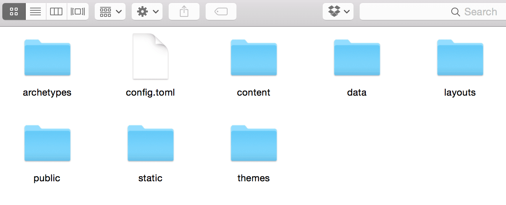
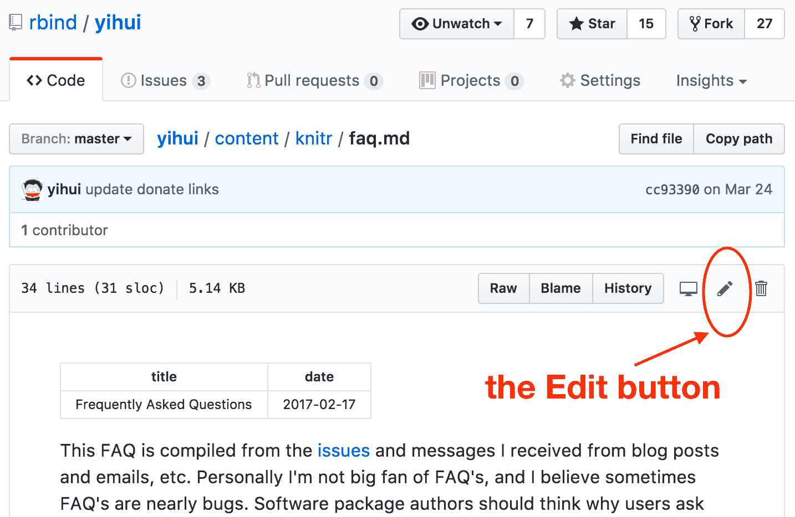

# Hugo

En este capítulo, presentaremos brevemente\index{Hugo} Hugo (https://gohugo.io), el generador de sitios estáticos en el que se basa **blogdown**. Este capítulo no pretende reemplazar la documentación oficial de Hugo, sino proporcionar una guía para aquellos que recién están comenzando con Hugo. En caso de duda, consulte la documentación oficial de Hugo.

## Sitios estáticos y Hugo {#static-sites}

Un sitio estático\index{Sitio estático} a menudo consiste en archivos HTML (con dependencias externas opcionales como imágenes y bibliotecas de JavaScript), y el servidor web envía exactamente el mismo contenido al navegador web sin importar quién visita las páginas web. No hay computación dinámica en el servidor cuando se solicita una página. En contraste, un sitio dinámico se basa en un lenguaje del lado del servidor para hacer cierta informática y envía contenido potencialmente diferente dependiendo de las diferentes condiciones. Un lenguaje común es PHP, y un ejemplo típico de un sitio dinámico es un foro web. Por ejemplo, cada usuario tiene una página de perfil, pero generalmente esto no significa que el servidor haya almacenado una página de perfil HTML diferente para cada usuario. En cambio, el servidor obtendrá los datos del usuario de una base de datos y renderizará la página de perfil de forma dinámica.

Para un sitio estático, cada URL que visita a menudo tiene un archivo HTML correspondiente almacenado en el servidor, por lo que no es necesario calcular nada antes de presentar el archivo a los visitantes. Esto significa que los sitios estáticos tienden a ser más rápidos en tiempo de respuesta que los sitios dinámicos, y también son mucho más fáciles de implementar, ya que la implementación simplemente significa copiar archivos estáticos a un servidor. Un sitio dinámico a menudo se basa en bases de datos, y tendrá que instalar más paquetes de software para presentar un sitio dinámico. Para obtener más ventajas de los sitios estáticos, lea la [introducción](https://gohugo.io/overview/introduction/) en el sitio web de Hugo.


Existen muchos generadores de sitios estáticos existentes, incluyendo Hugo, [Jekyll,](http://jekyllrb.com) y [Hexo,](https://hexo.io) etc. La mayoría de ellos puede construir sitios web de propósito general, pero a menudo se utilizan para construir blogs.

Amamos a Hugo por muchas razones, pero hay algunas que se destacan. A diferencia de otros generadores de sitios estáticos, la instalación de Hugo es muy simple porque proporciona un único archivo ejecutable sin dependencias para la mayoría de los sistemas operativos (consulte la sección \@ref(instalación)). También se diseñó para procesar cientos de páginas de contenido más rápido que los generadores de sitios estáticos comparables y, según los informes, puede presentar una página en aproximadamente 1 milisegundo. Por último, la comunidad de usuarios de Hugo es muy activa tanto en el [foro de discusión de Hugo](https://discuss.gohugo.io) y en los [issues de GitHub.](https://github.com/gohugoio/hugo/issues)

Aunque creemos que Hugo es un fantástico generador de sitios estáticos, en realidad hay una única característica importante que falta: el soporte para R Markdown. Ese es básicamente el objetivo del paquete **blogdown**.^[Otra motivación fue una manera más fácil de crear nuevas páginas o publicaciones. Los generadores de sitios estáticos a menudo proporcionan comandos para crear nuevas publicaciones, pero a menudo tiene que abrir y modificar el nuevo archivo creado a mano después de usar estos comandos. Estaba muy frustrado por esto, porque estaba buscando una interfaz gráfica de usuario donde simplemente pudiera completar el título, el autor, la fecha y otra información sobre una página, luego poder comenzar a escribir el contenido de inmediato. Es por eso que proporcioné el complemento de RStudio "New Post" y la función `blogdown::new_post()`. En los últimos años, lo odié cada vez que estaba a punto de crear una nueva publicación, ya sea a mano o a través de la línea de comandos de Jekyll. Finalmente, me volví adicto a los blogs una vez que terminé el complemento de RStudio.] Esta función faltante significa que no puede generar resultados fácilmente usando el código de R en sus páginas web, ya que solo puede usar documentos estáticos de Markdown. Además, el motor de Markdown predeterminado de Hugo es "Blackfriday", que es menos poderoso que Pandoc.^[El soporte de Pandoc se ha agregado en un pull request de Hugo: https://github.com/gohugoio/hugo/pull/4060. Sin embargo, creo que el soporte es bastante limitado, y le recomiendo que use el formato R Markdown, porque con el soporte oficial de Pandoc en Hugo, no puede personalizar las opciones de la línea de comandos de Pandoc, la renderización no está en caché (podría ser lento), y no podrá usar ninguna extensión de Markdown del paquete **bookdown** (como la numeración de los títulos de las figuras).]


Hugo usa una estructura especial de archivos y carpetas para crear su sitio web (Figura \@ref(fig:folders)). El resto de este capítulo brindará más detalles sobre los siguientes archivos y carpetas:

- `config.toml`
- `content/`
- `static/`
- `themes/`
- `layouts/`

(ref:folders) Posibles archivos y carpetas creados cuando crea un nuevo sitio usando **blogdown**.

```{r folders, fig.cap='(ref:folders)', echo=FALSE, fig.align='center', out.width='100%'}

```

## Configuración

El primer archivo que puede ver es el archivo configuration\index{config.toml} o `config` en su directorio raíz, en el que puede establecer configuraciones globales de su sitio. Puede contener opciones como el título y la descripción de su sitio, así como otras opciones globales como enlaces a sus redes sociales, el menú de navegación y la URL base de su sitio web.

Al generar su sitio, Hugo buscará primero un archivo llamado `config.toml`. Si no puede encontrar uno, continuará buscando `config.yaml`.^[Hugo también admite `config.json`, pero **blogdown** no lo admite, por lo que no recomendamos que lo use.] Como la mayoría de los temas de Hugo contienen sitios de ejemplo que envían archivos `config.toml`, y el formato TOML\index{TOML} (Tom's Obvious, Minimal Language) parece ser más popular en la comunidad de Hugo, hablaremos principalmente de `config.toml` aquí.

Recomendamos que utilice la sintaxis TOML solo para el archivo de configuración (también puede usar YAML si lo prefiere), y use YAML como el formato de datos para los metadatos de las páginas y publicaciones de R Markdown, porque R Markdown y **blogdown** son totalmente compatibles solo con YAML\index{YAML}.^[TOML tiene sus ventajas, pero creo que no son significativas en el contexto de los sitios web de Hugo. Es un dolor tener que conocer otro idioma, TOML, cuando YAML significa "Yet Another Markup Language". No estoy seguro de si el cómic XKCD se aplica en este caso: https://xkcd.com/927/.] Si tiene un sitio web que ya ha utilizado TOML, puede usar `blogdown::hugo_convert (unsafe = TRUE)` para convertir los datos de TOML a YAML, pero primero asegúrese de hacer una copia de seguridad del sitio web porque sobrescribirá los archivos de Markdown.

La documentación de Hugo no utiliza TOML o YAML consistentemente en sus ejemplos, lo que puede ser confuso. Preste mucha atención al formato de configuración al copiar ejemplos en su propio sitio web.

### Sintaxis TOML

Si no está familiarizado con la sintaxis de TOML, le daremos una breve descripción general y podrá leer la [documentación completa](https://github.com/toml-lang/toml) para conocer los detalles.

TOML se compone de pares clave-valor separados por signos iguales:

```js
key = value
```

Cuando desee editar una configuración en el archivo TOML, simplemente cambie el valor. Los valores que son cadenas de caracteres deben estar entre comillas, mientras que los valores booleanos deben estar minúsculos y descubiertos.

Por ejemplo, si desea darle a su sitio el título "Mi Sitio Impresionante" y usar URL relativas en lugar de las URL absolutas predeterminadas, puede tener las siguientes entradas en su archivo `config.toml`.

```js
title = "Mi sitio impresionante"

relativeURLs = true
```

La mayoría de las variables globales de su sitio web se ingresan en el archivo `config.toml` exactamente de esta manera.

Más adelante en su archivo `config`, puede observar algunos valores entre paréntesis como este:

```js
[social]
    github  = "https://github.com/rstudio/blogdown"
    twitter = "https://twitter.com/rstudio"
```

Esta es una tabla en el lenguaje TOML y Hugo los usa para completar información en otras páginas dentro de su sitio. Por ejemplo, la tabla anterior rellenará la variable `.Site.Social` en las plantillas de su sitio (más información sobre esto en la sección \@ref(templates)).

Por último, puede encontrar algunos valores en corchetes dobles como este:

```js
[[menu.main]]
    name = "Blog"
    url = "/blog/"

[[menu.main]]
    name = "Categories"
    url = "/categories/"

[[menu.main]]
    name = "About"
    url = "/about/"
```

En TOML, los corchetes dobles se usan para indicar una matriz de tablas. Hugo interpreta esta información como un menú. Si el código anterior se encuentra en un archivo `config.toml`, el sitio web resultante tendrá enlaces a las páginas Blog, Categorías y Acerca de en el menú principal del sitio. La ubicación y el estilo de ese menú se especifican en otra parte, pero aquí se definen los nombres de las opciones de cada menú y los enlaces a cada sección.

El archivo `config.toml` es diferente para cada tema. Asegúrese de que cuando elija un tema, lea su documentación a fondo para comprender lo que hace cada una de las opciones de configuración (más sobre los temas en la sección \@ref(temas)).

### Opciones

Todas las opciones incorporadas\index{opciones} que puede establecer para Hugo se enumeran en https://gohugo.io/overview/configuration/. Puede cambiar cualquiera de estas opciones, excepto `contentDir`, que está codificado en `content` en **blogdown**. Nuestra recomendación general es que será mejor que no modifique los valores predeterminados a menos que comprenda las consecuencias. Enumeramos algunas opciones que pueden ser de su interés:

- `baseURL`: Normalmente tiene que cambiar el valor de esta opción a la URL base\index{baseURL} de su sitio web. Algunos temas de Hugo pueden tenerlo configurado para `http://replace-this-with-your-hugo-site.com/` o `http://www.example.com/` en sus sitios de ejemplo, pero asegúrese de reemplazarlos con su propia URL (consulte el capítulo \@ref(implementación) y el apéndice \@ref(nombre-de-dominio) para obtener más información sobre la publicación de sitios web y la obtención de nombres de dominio). Tenga en cuenta que esta opción puede ser una URL con un subtrayecto, si su sitio web se publicará en una subruta de un nombre de dominio, e.g., `http://www.example.com/docs/`.

- `enableEmoji`: Puede\index{Emoji} configurarlo en `true` para que pueda usar [Emoticones Emoji ](http://www.emoji-cheat-sheet.com) como `:smile:` en Markdown.

- `permalinks`: Reglas para generar enlaces permanentes\index{permalinks} de sus páginas. Por defecto, Hugo usa nombres de archivos completos bajo `content/` para generar links, e.g., `content/about.md` será renderizado a `public/about/index.html`, y `content/post/2015-07-23-foo.md` será renderizado a `public/post/2015-07-23-foo/index.html`, entonces los enlaces reales son `/about/` y `/post/2015-07-23-foo/` en el sitio web. Aunque no es necesario establecer reglas personalizadas para enlaces permanentes, es común ver enlaces de la forma `/YYYY/mm/dd/post-title/`. Hugo le permite usar varias piezas de información sobre un archivo fuente para generar un enlace, como la fecha (año, mes y día), título y nombre de archivo, etc. El enlace puede ser independiente del nombre del archivo. Por ejemplo, puede pedirle a Hugo que presente páginas bajo `content/post/` usando la fecha y el título de sus enlaces:

    ```js
    [permalinks]
        post = "/:year/:month/:day/:title/"
    ```
    
    Personalmente, le recomiendo que use la variable \index{Slug} `:slug`^[Una slug es simplemente una cadena de caracteres que puede usar para identificar una publicación específica. Una slug no cambiará, incluso si el título cambia. Por ejemplo, si decide cambiar el título de su publicación de "Me encanta el blogdown" a "Por qué blogdown es el mejor paquete de la historia" y usó el título de la publicación en la URL, sus enlaces anteriores ahora se romperán. Si, en cambio, especifica la URL a través de un slug (algo así como "blogdown-love"), puede cambiar el título tantas veces como quiera y no terminará con enlaces rotos.] En lugar de `:títle`:
    
    ```js
    [permalinks]
        post = "/:year/:month/:day/:slug/"
    ```
    
    Esto se debe a que el título de su publicación puede cambiar, y es probable que no desee que el enlace a la publicación cambie; de lo contrario, debe redirigir el enlace anterior al nuevo enlace, y habrá otros tipos de problemas, como los comentarios de Disqus. La variable `:slug` vuelve a `:title` si un campo llamado `slug` no está establecido en los metadatos YAML de la publicación. Puede establecer un slug fijo para que el enlace a la publicación siempre sea fijo y tendrá la libertad de actualizar el título de su publicación.
    
    Puede encontrar una lista de todas las posibles variables que usted puede usar en la opción `permalinks` en https://gohugo.io/extras/permalinks/. 

- `publishDir`: El directorio bajo el cual quiere generar el sitio web.

- `theme`: El nombre del directorio de Hugo bajo `themes/`.

- `ignoreFiles`: Una lista de patrones de archivo (expresiones regulares) para Hugo con el fin de que ignore\index{ignoreFiles} ciertos archivos cuando se construye el sitio. Recomiendo que especifique al menos estos patrones `["\\.Rmd$", "\\.Rmarkdown$", "_files$", "_cache$"]`. Debería ignorar los archivos  `.Rmd` porque **blogdown** los compilará a `.html`, y le basta a Hugo usar los archivos `.html`. No hay necesidad de que Hugo construya archivos `.Rmd`, y actualmente Hugo no sabe cómo. Los directorios con sufijos `_files` y `_cache` deberían ser ignorados porque contienen archivos auxiliares una vez que un archivo Rmd se compila, y **blogdown** los almacenará. Hugo no los debería copiar de nuevo al directorio `public/`.

- `uglyURLs`: Por defecto, Hugo genera URLs "limpias"\index {uglyURLs}. Esto puede ser un poco sorprendente y requiere que comprenda cómo funcionan las URL cuando su buscador obtiene una página de un servidor. Básicamente, Hugo genera `foo/index.html` para `foo.md` de forma predeterminada en lugar de `foo.html`, porque el primero le permite visitar la página a través de la URL limpia `foo/` sin `index.html`. La mayoría de los servidores web entienden solicitudes como `http://www.example.com/foo/` y presentan `index.html` bajo `foo/`. Si prefiere el mapeo estricto de `*.md` a `*.html`, puede habilitar las URL "feas" configurando `uglyURLs` en `true`. 

- `hasCJKLanguage`: Si su sitio web se encuentra principalmente en CJK\index{hasCJKLanguage} (chino, coreano y japonés), le recomiendo que configure esta opción en `true`, para que el resumen automático y el recuento de palabras de Hugo funcionen mejor.

Además de las opciones incorporadas de Hugo, puede establecer otras opciones arbitrarias en `config.toml`. Por ejemplo, es muy común ver una opción llamada `params`, que se usa ampliamente en muchos temas de Hugo. Cuando vea una variable `.Site.Params.FOO` en un tema de Hugo, significa una opción `FOO` que se establece bajo `[params]` en `config.toml`, por ejemplo, `.Site.Params.author` es `Frida Gomam` con el siguiente archivo de configuración:

```js
[params]
    author = "Frida Gomam"
    dateFormat = "2006/01/02"
```

El objetivo de todas estas opciones es evitar cualquier problema de codificación en los temas de Hugo, de modo que los usuarios puedan editar fácilmente un único archivo de configuración para aplicar el tema a sus sitios web, en lugar de pasar por muchos archivos HTML y realizar cambios uno por uno.

## Contenido

La estructura del directorio `content/` puede ser arbitraria. Una estructura común es que hay algunas páginas estáticas bajo la raíz de `content/`, y un subdirectorio `post/` que contiene publicaciones de blog:

```bash
├── _index.md
├── about.md
├── vitae.md
├── post/
│   ├── 2017-01-01-foo.md
│   ├── 2017-01-02-bar.md
│   └── ...
└── ...
```

### Metadatos YAML

Cada página debe comenzar con los metadatos YAML\index {YAML} que especifican información como el título, la fecha, el autor, las categorías, las etiquetas, etc. Según el tema específico de Hugo y las plantillas que use, algunos de estos campos pueden ser opcionales.

Entre todos los campos de YAML, queremos llamar su atención sobre estos:

- `draft`: Puede marcar un documento como borrador\index {Borrador} configurando `draft: true` en sus metadatos YAML. Los borradores de mensajes no se mostrarán si el sitio se compila mediante `blogdown::build_site()` o `blogdown::hugo_build ()`, pero se presentarán en el modo de vista previa local (consulte la sección \@ref(local-preview))

- `publishdate`: Puede especificar una fecha futura \index{Publicar fecha} para publicar un post. Al igual que en las publicaciones preliminares, las publicaciones futuras solo se presentan en el modo de vista previa local.

- `weight`: Este campo puede tomar un valor numérico para indicarle a Hugo el orden de las páginas al ordenarlas \index{Peso del Post}; por ejemplo, cuando genera una lista de todas las páginas debajo de un directorio y dos publicaciones tienen la misma fecha, puede asignar diferentes ponderaciones para obtener el orden deseado en la lista.

- `slug`: Una cadena de caracteres como la cola de la URL. Es particularmente útil cuando define reglas personalizadas para URL permanentes (vea la sección \@ref(opciones)).

### Cuerpo

Como mencionamos en la sección \@ref(formato de salida), su publicación puede escribirse en R o Markdown. Tenga cuidado con las diferencias de sintaxis entre los dos formatos cuando escribe el cuerpo de una publicación.

### Código corto

Además de todas las características de Markdown, Hugo proporciona una característica útil llamada "códigos abreviados". Puede usar un shortcode\index{Shortcode} en el cuerpo de su publicación. Cuando Hugo presenta la publicación, puede generar automáticamente un fragmento de HTML basado en los parámetros que pasa al código corto. Esto es conveniente porque no tiene que escribir o insertar una gran cantidad de código HTML en su publicación. Por ejemplo, Hugo tiene un código abreviado incorporado para incrustar tarjetas de Twitter. Normalmente, así es como inserta una tarjeta de Twitter (Figura \@ref(fig: jtleek-tweet)) en una página:

```html
<blockquote class="twitter-tweet">
  <p lang="en" dir="ltr">Anyone know of an R package for
    interfacing with Alexa Skills?
    <a href="https://twitter.com/thosjleeper">@thosjleeper</a>
    <a href="https://twitter.com/xieyihui">@xieyihui</a>
    <a href="https://twitter.com/drob">@drob</a>
    <a href="https://twitter.com/JennyBryan">@JennyBryan</a>
    <a href="https://twitter.com/HoloMarkeD">@HoloMarkeD</a> ?
  </p>
  &mdash; Jeff Leek (@jtleek)
  <a href="https://twitter.com/jtleek/status/852205086956818432">
    April 12, 2017
  </a>
</blockquote>
<script async src="//platform.twitter.com/widgets.js" charset="utf-8">
</script>
```

```{r jtleek-tweet, fig.cap='A tweet by Jeff Leek.', fig.align='center', out.width='80%', echo=FALSE}

```

Si usa el código abreviado, todo lo que necesita en el documento fuente de reducción es:

```go

```

Básicamente, solo necesita pasar el ID del tweet a un código corto llamado `tweet`. Hugo buscará el tweet automáticamente y renderizará el fragmento de HTML por usted. Para obtener más información sobre los códigos abreviados, consulte https://gohugo.io/extras/shortcodes/.

Se supone que los códigos cortos funcionan solo en documentos de Markdown. Para usar códigos abreviados en R Markdown en lugar de Markdown simple, debe llamar a la función `blogdown::shortcode()`, e.g.,

````markdown
`r ''````{r echo=FALSE}
blogdown::shortcode('tweet', '852205086956818432')
```
````

## Temas

Un tema de Hugo\index{Temas} es una colección de plantillas y archivos opcionales del sitio web, como archivos CSS y JavaScript. En pocas palabras, un tema define el aspecto de su sitio web después de que su contenido fuente se presente a través de las plantillas.

Hugo ha proporcionado una gran cantidad de temas aportados por los usuarios en https://themes.gohugo.io. A menos que sea un diseñador web experimentado, es mejor que comience desde un tema existente aquí. La calidad y la complejidad de estos temas varían mucho, y debe elegir uno con precaución. Por ejemplo, puede ver el número de estrellas de un repositorio de temas en GitHub, así como si el repositorio todavía está relativamente activo. No recomendamos utilizar un tema que no se haya actualizado durante más de un año.

En esta sección, explicaremos cómo funciona el tema predeterminado en **blogdown**, que también puede brindarle algunas ideas sobre cómo comenzar con otros temas.

### El tema por defecto

El tema predeterminado en **blogdown**, hugo-lithium-theme\index{Hugo Lithium Theme}, está alojado en GitHub en https://github.com/yihui/hugo-lithium-theme. Fue escrito originalmente por Jonathan Rutheiser, y he realizado varios cambios en él. Este tema es adecuado para quienes prefieren estilos mínimos y desean crear un sitio web con algunas páginas y algunas publicaciones en el blog.

Normalmente, un repositorio de temas en GitHub tiene un archivo `README`, que también sirve como la documentación del tema. Después de leerlo, el siguiente archivo para buscar es `config.toml` en el directorio `exampleSite`, que contiene configuraciones de muestra para un sitio web basado en este tema. Si un tema no tiene un archivo `README` o` exampleSite`, probablemente no debería usarlo.

El `config.toml` del tema hugo-lithium-theme contiene las siguientes opciones:

```js
baseurl = "/"
relativeurls = false
languageCode = "en-us"
title = "A Hugo website"
theme = "hugo-lithium-theme"
googleAnalytics = ""
disqusShortname = ""
ignoreFiles = ["\\.Rmd$", "\\.Rmarkdown", "_files$", "_cache$"]

[permalinks]
    post = "/:year/:month/:day/:slug/"

[[menu.main]]
    name = "About"
    url = "/about/"
[[menu.main]]
    name = "GitHub"
    url = "https://github.com/rstudio/blogdown"
[[menu.main]]
    name = "Twitter"
    url = "https://twitter.com/rstudio"

[params]
    description = "A website built through Hugo and blogdown."

    highlightjsVersion = "9.11.0"
    highlightjsCDN = "//cdn.bootcss.com"
    highlightjsLang = ["r", "yaml"]
    highlightjsTheme = "github"

    MathJaxCDN = "//cdn.bootcss.com"
    MathJaxVersion = "2.7.1"

[params.logo]
    url = "logo.png"
    width = 50
    height = 50
    alt = "Logo"
```

Algunas de estas opciones pueden ser obvias para comprender, y algunas pueden necesitar explicaciones:

- `baseurl`: Puede\index{baseURL} configurar esta opción después, después de tener un nombre de dominio para su sitio web. No olvide la barra inclinada.

- `relativeurls`: Esto es opcional. Puede configurarlo como `true` solo si tiene la intención de ver su sitio web localmente a través de su visor de archivos, por ejemplo, hacer doble clic en un archivo HTML y verlo en su navegador. Esta opción tiene como valor predeterminado `false` en Hugo, y significa que su sitio web debe ser visto a través de un servidor web, por ejemplo, `blogdown::serve_site()` ha proporcionado un servidor web local, por lo que puede obtener una vista previa localmente cuando `relativeurls = false`.

- `title`: El título de su sitio web. Típicamente esto se muestra en la barra de título del buscador web o sobre una pestaña de página.

- `theme`: El nombre del directorio del tema. Debe tener mucho cuidado al cambiar los temas, porque un tema puede ser drásticamente diferente de otro tema en términos de configuraciones. Es muy posible que un tema diferente no funcione con su `config.toml` actual. De nuevo, debe leer la documentación de un tema para saber qué opciones son compatibles o requeridas.

- `googleAnalytics`: El ID de seguimiento de Google Analytics\index{Google Analytics} (por ejemplo, `UA-000000-2`). Puede inscribirse en https://analytics.google.com para obtener un IDde seguimiento.

- `disqusShortname`: El ID de Disqus\index{Comentarios de Disqus} que creó durante el proceso de configuración de la cuenta en https://disqus.com. Esto es necesario para habilitar los comentarios en su sitio.^[Como mencionamos en la sección \@ref(sitios estáticos), **blogdown** genera contenido estático e inmutable. Para agregar algo dinámico y siempre cambiante (como la posibilidad de que sus seguidores dejen comentarios), debe incorporar un sistema de comentarios externo como Disqus.] Tenga en cuenta que debe configurar un `baseurl` funcional y publicar su sitio web antes de que los comentarios de Disqus pueda funcionar.

- `ignoreFiles` y `permalinks`: Estas opciones han sido explicadas en la sección \@ref(opciones).

- `menu`: Esta lista de opciones especifica el texto y la URL de los elementos del menú en la parte superior. Ver la figura \@ref(fig:lithium) para una página de muestra. Puede cambiar o agregar más elementos de menú. Si desea ordenar los artículos, puede asignar un `peso` a cada artículo, e.g.,

    ```js
    [[menu.main]]
        name = "Home"
        url = "/"
        weight = 1
    [[menu.main]]
        name = "About"
        url = "/about/"
        weight = 2
    [[menu.main]]
        name = "GitHub"
        url = "https://github.com/rstudio/blogdown"
        weight = 3
    [[menu.main]]
        name = "CV"
        url = "/vitae/"
        weight = 4
    [[menu.main]]
        name = "Twitter"
        url = "https://twitter.com/rstudio"
        weight = 5
    ```
    
    En el ejemplo anterior, agregué un elemento de menú `CV` con la URL `/vitae/`, y se supone que hay un archivo fuente correspondiente `vitae.md` debajo del directorio `content/` para generar la página `/vitae/index.html`, por lo que el enlace realmente funcionará.

- `params`: Diversos parámetros\index{params} del tema.

    - `description`: Una breve descripción de su sitio web. No es visible en las páginas web (solo puede verlo desde la fuente HTML), pero debe dar a los motores de búsqueda una pista sobre su sitio web.
    
    - `highlightjs*`: Estas opciones se usan para configurar las librerías de JavaScript\index{Syntax Highlighting} [highlight.js](https://highlightjs.org) para resaltar la sintaxis de los bloques de código sobre las páginas web. Puede cambiar la versión (e.g., `9.12.0`), el hosto CND (e.g., usando [cdnjs](https://cdnjs.com): `//cdnjs.cloudflare.com/ajax/libs`), agregar más lenguajes (e.g., `["r", "yaml", "tex"]`), y cambiar el tema (e.g., `atom-one-light`). Vea https://highlightjs.org/static/demo/ para todos los lenguajes y temas que highlight.js soporta.
    
    - `MathJax*`: La librería de JavaScript MathJax\index{MathJax} puede renderizar expresiones matemáticas en LaTeX sobre páginas web. De la misma forma que `highlightjsCDN`, puede especificar el host CDN de MathJax, e.g., `//cdnjs.cloudflare.com/ajax/libs`, y puede especificar la versión de MathJax.
    
    - `logo`: Una lista de opciones para definir el logo\index{Logo} del sitio web. Por defecto, la imagen `logo.png` bajo el directorio `static/` se usa.

Si quiere ser un desarrollador de temas y comprender completamente todos los detalles técnicos sobre estas opciones, debe comprender las plantillas de Hugo, que presentaremos en la sección \@ref(plantillas).

## Plantillas

Un tema de Hugo consta de dos componentes principales: plantillas\index{Templates} y archivos web. El primero es esencial y le dice a Hugo cómo presentar una página.^[La funcionalidad más común de las plantillas es hacer páginas HTML, pero también puede haber plantillas especiales, por ejemplo, para fuentes RSS y sitemaps, que son archivos XML.] El último es opcional pero también importante. Por lo general, consta de archivos CSS y JavaScript, así como otros recursos, como imágenes y videos. Estos activos determinan la apariencia y la funcionalidad de su sitio web, y algunos pueden estar integrados en el contenido de sus páginas web.

Puede obtener más información sobre las plantillas de Hugo en la documentación oficial (https://gohugo.io/templates/overview/). Hay muchos tipos diferentes de plantillas. Para que le resulte más fácil dominar las ideas clave, creé un tema de Hugo muy mínimo, que cubre la mayoría de las funcionalidades que un usuario promedio puede necesitar, pero el número total de líneas es de solo 150, por lo que podemos hablar de todas las fuentes código de este tema en la siguiente subsección.

### Un pequeño ejemplo

[XMin](https://github.com/yihui/hugo-xmin) es un tema de Hugo\index{Tema XMin}. Lo escribí desde cero en aproximadamente 12 horas. Aproximadamente media hora se gastó en plantillas, se dedicaron 3,5 horas a modificar los estilos CSS y se gastaron 8 horas en la documentación (https://xmin.yihui.name). Creo que este puede ser un caso representativo de cuánto tiempo pasaría en cada parte cuando diseñe un tema. Está, quizás, en nuestra naturaleza pasar mucho más tiempo en cosas cosméticas como CSS que en cosas esenciales como plantillas. Mientras que la codificación es, a menudo, más fácil que la documentación.

Mostraremos el código fuente del tema XMin. Debido a que el tema puede actualizarse ocasionalmente en el futuro, puede seguir este enlace para obtener una versión fija de la que hablaremos en esta sección: https://github.com/yihui/hugo-xmin/tree/4bb305. A continuación se muestra una vista en árbol de todos los archivos y directorios del tema:

```bash
hugo-xmin/
├── LICENSE.md
├── README.md
├── archetypes
│   └── default.md
├── layouts
│   ├── 404.html
│   ├── _default
│   │   ├── list.html
│   │   ├── single.html
│   │   └── terms.html
│   └── partials
│       ├── foot_custom.html
│       ├── footer.html
│       ├── head_custom.html
│       └── header.html
├── static
│   └── css
│       ├── fonts.css
│       └── style.css
└── exampleSite
    ├── config.toml
    ├── content
    │   ├── _index.md
    │   ├── about.md
    │   ├── note
    │   │   ├── 2017-06-13-a-quick-note.md
    │   │   └── 2017-06-14-another-note.md
    │   └── post
    │       ├── 2015-07-23-lorem-ipsum.md
    │       └── 2016-02-14-hello-markdown.md
    ├── layouts
    │   └── partials
    │       └── foot_custom.html
    └── public
        └── ...
```

`LICENSE.md` y `README.md` no son componentes necesarios de un tema, pero definitivamente debe elegir una licencia para su código fuente para que otras personas puedan usar su código correctamente, y un `README` puede ser la breve documentación de su software.

El archivo `archetypes/default.md` define la plantilla predeterminada en función de qué usuarios pueden crear nuevas publicaciones. En este tema, `default.md` solo proporcionaba metadatos YAML vacíos:

```yaml
---
---
```

Los directorios más importantes de un tema son `layouts/` y `static/`. Las plantillas HTML se almacenan en `layouts/`, y los archivos se almacenan en `static/`.

Para comprender `layouts/`, debe conocer algunos conceptos básicos sobre HTML (consulte la sección \@ref(html)) porque las plantillas en este directorio son, en su mayoría, documentos o fragmentos HTML. Hay muchos tipos posibles de subdirectorios en `layouts/`, pero solo vamos a introducir dos aquí: `_default/` y `partials/`.

- El directorio `_default/`\index{\_default/} es donde almacena las plantillas predeterminadas para sus páginas web. En el tema XMin, tenemos tres plantillas: `single.html`,` list.html`, y `terms.html`.

    - `single.html` es una plantilla\index{single.html} para presentar páginas individuales. Una sola página básicamente corresponde a un documento de Markdown bajo `content/`, y contiene tanto los metadatos (YAML) como el contenido. Por lo general, queremos mostrar el título de la página, el autor, la fecha y el contenido. A continuación se muestra el código fuente de `single.html` de XMin:

        ```html
        {{ partial "header.html" . }}
        <div class="article-meta">
        <h1><span class="title">{{ .Title }}</span></h1>
        {{ with .Params.author }}
        <h2 class="author">{{ . }}</h2>
        {{ end }}
        {{ if .Params.date }}
        <h2 class="date">{{ .Date.Format "2006/01/02" }}</h2>
        {{ end }}
        </div>
        
        <main>
        {{ .Content }}
        </main>
        
        {{ partial "footer.html" . }}
        ```
        
        Verá muchos pares de corchetes `{{}}`, y así es como se programan las plantillas usando las variables y funciones de Hugo.
        
        La plantilla comienza con una plantilla parcial `header.html`, para la cual verá el código fuente pronto. Por ahora, puede imaginarlo como todas las etiquetas HTML antes del cuerpo de su página (e.g., `<html><head>`). Ls plantillas parciales\index{Parciales} se usan, principalmente, para reutilizar código HTML. Por ejemplo, todas las páginas HTML pueden compartir tags muy similares `<head></head>`, y puede factorizar las partes comunes en plantillas parciales.
        
        Los metadatos de una página se incluyen en un elemento `<div>` con la clase `article-meta`. Recomendamos que asigne clases a elementos HTML al diseñar plantillas, de modo que sea más fácil aplicar estilos CSS a estos elementos usando nombres de clase. En una plantilla, tiene acceso a muchas variables proporcionadas por Hugo, por ejemplo, la variable `.Title` almacena el valor del título de la página, y escribimos el título en `<span>` en un encabezado de primer nivel `<h1>`. De forma similar, el autor y la fecha se escriben en `<h2>`, pero solo si se proporcionan en los metadatos YAML. La sintaxis `{{ con FOO }}{{ . }}{{ end }}` es una abreviatura de `{{si FOO }}{{ FOO }}{{ end }}`, es decir, le ahorra el esfuerzo de digitar la expresión `FOO` dos veces usando `{{ . }}`. El método `.Format` se puede aplicar a un objeto de fecha, y en este tema, formateamos las fechas en el formato `YYYY/mm/dd` (`2006/01/02` es la forma de especificar el formato en Go) .
        
        Luego mostramos el contenido de una página, que se almacena en la variable `.Content`. El contenido está envuelto en una etiqueta HTML semántica `<main>`.
        
        La plantilla finaliza después de incluir otra plantilla parcial `footer.html` (código fuente que se mostrará en breve).
        
        Para que sea más fácil de entender cómo funciona una plantilla, mostramos un mínimo ejemplo de publicación a continuación:
        
        ```markdown
        ---
        title: Hello World
        author: Frida Gomam
        date: 2017-06-19
        ---
        
        A single paragraph.
        ```
        
        Con la plantilla `single.html`, se convertirá en una página HTML con un código fuente que se parece más o menos a esto (con el encabezado y el pie de página omitidos):

        ```html
        <div class="article-meta">
          <h1><span class="title">Hello World</span></h1>
          <h2 class="author">Frida Gomam</h2>
          <h2 class="date">2017/06/19</h2>
        </div>
        
        <main>
          <p>A single paragraph.</p>
        </main>
        ```
        
        Para un ejemplo completo de una página sencilla, puede ver https://xmin.yihui.name/about/.

    - `list.html` es la plantilla\index{list.html} para generar listas de páginas, como una lista de publicaciones de blog, o una lista de páginas dentro de una categoría o etiqueta. Aquí está su código fuente:

        ```html
        {{ partial "header.html" . }}
        
        {{if not .IsHome }}
        <h1>{{ .Title }}</h1>
        {{ end }}
        
        {{ .Content }}
        
        <ul>
          {{ range (where .Data.Pages "Section" "!=" "") }}
          <li>
            <span class="date">{{ .Date.Format "2006/01/02" }}</span>
            <a href="{{ .URL }}">{{ .Title }}</a>
          </li>
          {{ end }}
        </ul>
        
        {{ partial "footer.html" . }}
        ```
        
        Nuevamente, usa dos plantillas parciales `header.html` y `footer.html`. La expresión `{{if not .IsHome}}` significa, si esta lista no es la página de inicio, muestre el título de la página. Esto es porque no quiero mostrar el título en la página de inicio. Es solo mi preferencia personal. Sin duda, puede mostrar el título en `<h1>` en la página de inicio, si lo desea.

        El `{{.Content}}` muestra el contenido de la lista. Tenga en cuenta que típicamente `.Content` está vacío, lo que puede sorprender. Esto se debe a que una página de lista no se genera a partir de un archivo de marca de origen de forma predeterminada. Como sea, hay una excepción. Cuando se escribe un archivo Markdown especial `_index.md` en un directorio correspondiente al nombre de la lista, el `.Contenido` de la lista será el contenido de este archivo Markdown. Por ejemplo, puede definir el contenido de su página de inicio en `content/_index.md`, y el contenido de la página de la lista de publicaciones en `content/post/_index.md`.

        A continuación, generamos la lista utilizando un bucle (`range`) a través de todas las páginas filtradas por la condición de que la sección de una página no debe estar vacía. "Section" en Hugo significa el nombre del subdirectorio de primer nivel bajo `content/`. Por ejemplo, la sección de `content/post/foo.md` es `post`. Por lo tanto, el filtro significa que enumeraremos todas las páginas bajo subdirectorios de `content/`. Esto excluirá las páginas debajo del directorio raíz `content/`, como `content/about.md`.

        Tenga en cuenta que la variable `.Data` es dinámica y su valor cambia de acuerdo con la lista específica que desea generar. Por ejemplo, la página de la lista https://xmin.yihui.name/post/ solo contiene páginas bajo `content/post/`, y https://xmin.yihui.name/note/ solo contiene páginas bajo `content/note/`. Estas páginas de lista son generadas automáticamente por Hugo, y no necesita pasar explícitamente por las secciones `publicación` y `nota`. Es decir, una sola plantilla `list.html` generará múltiples listas de páginas según las secciones y los términos de taxonomía (por ejemplo, categories y tags) que tenga en su sitio web.

        Los elementos de la lista están representados por las etiquetas HTML `<li>` en `<ul>`. Cada elemento consta de la fecha, el enlace y el título de una página. Puede ver https://xmin.yihui.name/post/ para obtener un ejemplo completo de una página de lista.

    - `terms.html` es la plantilla\index{terms.html} para la página de inicio de los términos de la taxonomía. Por ejemplo, puede usarlo para generar la lista completa de categorías o etiquetas. El código fuente está a continuación:

        ```html
        {{ partial "header.html" . }}
        
        <h1>{{ .Title }}</h1>
        
        <ul class="terms">
          {{ range $key, $value := .Data.Terms }}
          <li>
            <a href='{{ (print "/" $.Data.Plural "/" $key) | relURL }}'>
              {{ $key }}
            </a>
            ({{ len $value }})
          </li>
          {{ end }}
        </ul>
        
        {{ partial "footer.html" . }}
        ```
        
        Similar a `list.html`, también usa un bucle. La variable `.Data.Terms` almacena todos los términos bajo una taxonomía, por ejemplo, todos los nombres de categorías. Puede considerarlo como una lista con nombre en R (llamado 'map' en Go), cuyos nombres son los términos y los valores son listas de páginas. La variable `$key` denota el término y `$value` denota la lista de páginas asociadas con este término. Lo que presentamos en cada `<li>` es un enlace al término página, así como el recuento de publicaciones que utilizan este término (`len` es una función Go que devuelve la longitud de un objeto).

        Hugo representa automáticamente todas las páginas de taxonomía, y los nombres de ruta son las formas plurales de las taxonomías, por ejemplo, https://xmin.yihui.name/categories/ y https://xmin.yihui.name/tags/. Ese es el significado de `.Data.Plural`. El `$` inicial es obligatorio porque estamos dentro de un bucle y necesitamos acceder a variables del alcance externo. El enlace del término se pasa a la función Hugo `relURL` a través de una conector `|` para hacerlo relativo, lo cual es una buena práctica porque los enlaces relativos son más portátiles (independientemente del nombre de dominio).

- El directorio `parials/` es el lugar para poner los fragmentos HTML para ser reutilizados por otras plantillas a través de la función `partial`. Tenemos cuatro plantillas parciales bajo este directorio:

    - `header.html` define\index{header.html} la etiqueta `<head>` y el menú de navegación en la etiqueta `<nav>`.

        ```html
        <!DOCTYPE html>
        <html lang="{{ .Site.LanguageCode }}">
          <head>
            <meta charset="utf-8">
            <title>{{ .Title }} | {{ .Site.Title }}</title>
            <link href='{{ "/css/style.css" | relURL }}'
              rel="stylesheet" />
            <link href='{{ "/css/fonts.css" | relURL }}'
              rel="stylesheet" />
            {{ partial "head_custom.html" . }}
          </head>
        
          <body>
            <nav>
            <ul class="menu">
              {{ range .Site.Menus.main }}
              <li><a href="{{ .URL | relURL }}">{{ .Name }}</a></li>
              {{ end }}
            </ul>
            <hr/>
            </nav>
        ```
        
        El área `<head>` debe ser fácil de entender si está familiarizado con HTML. Tenga en cuenta que también incluimos una plantilla parcial `head_custom.html`, que está vacía en este tema, pero hará que sea mucho más fácil para los usuarios agregar código personalizado a `<head>` sin reescribir toda la plantilla. Ver la sección \@ref(layouts personalizados) para más detalles.

        El menú de navegación es esencialmente una lista, y cada elemento de la lista se lee de la variable `.Site.Menus.main`. Esto significa que los usuarios pueden definir el menú en `config.toml`, e.g., 
      
        ```js  
        [[menu.main]]
            name = "Home"
            url = "/"
        [[menu.main]]
            name = "About"
            url = "/about/"
        ```

        Esto generará un menú como:
        
        ```html
        <ul class="menu">
          <li><a href="/">Home</a></li>
          <li><a href="/about/">About</a></li>
        </ul>
        ```
        
        Hugo tiene un poderoso sistema de menú, y solo usamos el tipo más simple de menú en este tema. Si está interesado en más funciones como menús anidados, consulte la documentación completa en http://gohugo.io/extras/menus/.

        - `footer.html` define el área footer\index{footer.html} de una página y cierra el documento HTML:

        ```html
          <footer>
          {{ partial "foot_custom.html" . }}
          {{ with .Site.Params.footer }}
          <hr/>
          {{ . | markdownify }}
          {{ end }}
          </footer>
          </body>
        </html>
        ```
        
        El propósito de la plantilla parcial `foot_custom.html` es el mismo que `head_custom.html`; es decir, para permitir que el usuario agregue código personalizado al `<footer>` sin volver a escribir la plantilla completa.

        Por último, usamos la variable `.Site.Params.footer` para generar un pie de página. Tenga en cuenta que utilizamos la función `with` nuevamente. Recuerde que la sintaxis `{{with .Site.Params.footer}}{{ . }}{{ end }}` es una abreviatura de `{{if .Site.Params.footer }}{{.Site.Params.footer }}{{ end }}`. Esta sintaxis le evita escribir dos veces la expresión `.Site.Params.footer` usando `{{ . }}` como un marcador de posición para la variable `footer`, que se define como un parámetro de sitio en nuestro archivo `config.toml`. La función adicional `markdownify` puede convertir Markdown a HTML (es decir, ` {{ . | markdownify}} `. En conjunto, esta secuencia significa que podemos definir una opción `footer` usando Markdown bajo `params` en `config.toml`, e.g.,
        
        ```js
        [params]
            footer = "&copy; [Yihui Xie](https://yihui.name) 2017"
        ```

Hay una plantilla especial `404.html`, que Hugo usa para crear la página 404\index{404.html} (cuando no se encuentra una página, se muestra esta página):

```html
{{ partial "header.html" . }}

404 NOT FOUND

{{ partial "footer.html" . }}
```

Con todas las plantillas anteriores, podremos generar un sitio web a partir de los archivos fuente de Markdown. Sin embargo, es poco probable que esté satisfecho con el sitio web porque los elementos HTML no tienen ningún estilo y la apariencia predeterminada puede no parecer atractiva para la mayoría de las personas. Puede haber notado que en `header.html`, hemos incluido dos archivos CSS, `/css/style.css` y `/css/fonts.css`.

Puede encontrar muchos frameworks CSS de código abierto existentes que se pueden aplicar a un tema de Hugo. Por ejemplo, el framework CSS más popular puede ser Bootstrap: http://getbootstrap.com. Cuando estaba diseñando XMin, me preguntaba hasta dónde podría llegar sin usar ninguno de estos frameworks existentes, porque generalmente son muy grandes. Por ejemplo, `bootstrap.css` tiene casi 10000 líneas de código cuando no se minimiza. Resultó que pude obtener una apariencia satisfactoria con aproximadamente 50 líneas de CSS, que explicaré en detalle a continuación:

- `style.css` define todos los estilos excepto las fuentes tipográficas:

    ```css
    body {
      max-width: 800px;
      margin: auto;
      padding: 1em;
      line-height: 1.5em;
    }
    ```
    
    El ancho máximo del cuerpo de la página se establece en 800 píxeles porque una página excesivamente ancha es difícil de leer (`800` es un umbral arbitrario que elegí). El cuerpo se centra utilizando el truco de CSS `margin: auto`, lo que significa que los márgenes superior, derecho, inferior y izquierdo son automáticos. Cuando los márgenes izquierdo y derecho de un elemento de bloque son `auto`, estará centrado. 
    
    ```css
    /* header and footer areas */
    .menu li { display: inline-block; }
    .article-meta, .menu a {
      text-decoration: none;
      background: #eee;
      padding: 5px;
      border-radius: 5px;
    }
    .menu, .article-meta, footer { text-align: center; }
    .title { font-size: 1.1em; }
    footer a { text-decoration: none; }
    hr {
      border-style: dashed;
      color: #ddd;
    }
    ```
    
    Recuerde que nuestro elemento de menú es una lista `<ul class="menu">` definida en `header.html`. Cambié el estilo de visualización predeterminado de `<li>` dentro del menú a `inline-block`, de modo que se distribuyan de izquierda a derecha como elementos en línea, en lugar de apilarse verticalmente como una lista de viñetas (el comportamiento predeterminado))

    Para los enlaces (`<a>') en el menú y el área de metadatos de un artículo, se elimina la decoración de texto predeterminada (subrayados) y se aplica un color de fondo claro. El radio del borde se establece en 5 píxeles para que pueda ver un rectángulo sutil de esquina redondeada detrás de cada enlace.

    La regla horizontal (`<hr>`) se establece en una línea discontinua de color gris claro para que sea menos prominente en una página. Estas reglas se utilizan para separar el cuerpo del artículo de las áreas de encabezado y pie de página.
    
    ```css
    /* code */
    pre {
      border: 1px solid #ddd;
      box-shadow: 5px 5px 5px #eee;
      padding: 1em;
      overflow-x: auto;
    }
    code { background: #f9f9f9; }
    pre code { background: none; }
    ```
    
    Para bloques de código (`<pre>`), aplico bordes gris claro con efectos de sombra paralela. Cada elemento de código en línea tiene un fondo gris muy claro. Estas decoraciones son simplemente por mi propio interés y énfasis peculiares en el código.
    
    ```css
    /* misc elements */
    img, iframe, video { max-width: 100%; }
    main { hyphens: auto; }
    blockquote {
      background: #f9f9f9;
      border-left: 5px solid #ccc;
      padding: 3px 1em 3px;
    }
    
    table {
      margin: auto;
      border-top: 1px solid #666;
      border-bottom: 1px solid #666;
    }
    table thead th { border-bottom: 1px solid #ddd; }
    th, td { padding: 5px; }
    tr:nth-child(even) { background: #eee }
    ```
    
    Los elementos incrustados, como las imágenes y los videos que exceden el margen de la página, a menudo son desagradables, por lo que restrinjo su ancho máximo al 100%. La separación silábica está activada para palabras en `<main>`. Las citas en bloque tienen una barra lateral izquierda gris y un fondo gris claro. Las tablas están centradas de manera predeterminada, con solo tres reglas horizontales: los bordes superior e inferior de la tabla y el borde inferior de la tabla. Las filas de la tabla están rayadas para facilitar la lectura de la tabla, especialmente cuando la tabla es ancha.

- `fonts.css` es una hoja de estilo separada\index{fonts.css} porque juega un papel crítico en la apariencia de un sitio web, y es muy probable que desee personalizar este archivo. En la mayoría de los casos, sus lectores dedicarán la mayor parte del tiempo a leer el texto en sus páginas, por lo que es importante hacer que el texto sea cómodo de leer. No soy un experto en diseño web, y acabo de elegir Palatino para el cuerpo y Lucida Console o Monaco (cualquiera que esté disponible en su sistema) para el código. Es común usar las fuentes web de Google hoy en día. Puede probar algunas fuentes web y ver si le gusta alguno de ellos.
    
    ```css
    body {
      font-family: "Palatino Linotype", "Book Antiqua", Palatino, serif;
    }
    code {
      font-family: "Lucida Console", Monaco, monospace;
      font-size: 85%;
    }
    ```

Los dos archivos CSS se colocan bajo el directorio `static/css/` del tema. En la plantilla HTML `header.html`, la ruta `/css/style.css` se refiere al archivo `static/css/style.css`.

Por último, este tema proporcionó un sitio de ejemplo en `exampleSite/`. La estructura del directorio puede ser un poco confusa porque este es un tema en lugar de un sitio web. En la práctica, todo lo que se encuentra debajo de `exampleSite/` debe estar debajo del directorio raíz de un sitio web, y el directorio `hugo-xmin/` de nivel superior debe estar bajo el directorio `themes/` de este sitio web, i.e.,

```bash
├── config.toml
├── content/
├── ...
├── themes/
│   └── hugo-xmin/
│
└── ...
```

El sitio de ejemplo proporciona una muestra `config.toml`, una página de inicio `_index.md`, una página sobre `about.md`, dos publicaciones bajo `note/` y dos bajo `post/`. También anula el `foot_custom.html` en el tema.

### Implementando más funciones {#how-to}

El XMin es en realidad un tema altamente funcional, pero entendemos que puede ser demasiado mínimo para usted. Hay algunas características comúnmente utilizadas (intencionalmente) que faltan en este tema, y le enseñaremos cómo agregarlas usted mismo si así lo desea. Todas estas características y el código fuente se pueden aplicar también a otros temas.

- **Activar Google Analytics.** Hugo\index{Google Analytics} ha proporcionado una plantilla parcial. Para XMin, puede agregar

    ```html
    {{ template "_internal/google_analytics.html" . }}
    ```

    a `layouts/partials/foot_custom.html` bajo el directorio raiz de su sitio web (en lugar de `themes/hugo-xmin/`), y configurar `googleAnalytics` en el `config.toml`. Vea https://github.com/yihui/hugo-xmin/pull/3 para detalles, y la fuente HTML de esta página para el JavaScript renderizado desde la plantilla: https://deploy-preview-3--hugo-xmin.netlify.com.

- **Activar comentarios Disqus.** Similar a Google Analytics\index{Comentarios de Disqus}, puedes agregar la plantilla incorporada

    ```html
    {{ template "_internal/disqus.html" . }}
    ```

    a `foot_custom.html`, y configurar el nombre corto Disqus en `config.toml`. Vea https://github.com/yihui/hugo-xmin/pull/4 para detalles, y una vista previa en https://deploy-preview-4--hugo-xmin.netlify.com.

- **Configurar sintaxis resaltada mediante highlight.js.** Agregue esto\index{Resaltar sintaxis} a `head_custom.html`

    ```html
    <link href="//YOUR-CDN-LINK/styles/github.min.css" rel="stylesheet">
    ```
    
    and this to `foot_custom.html`:
    
    ```html
    <script src="//YOUR-CDN-LINK/highlight.min.js"></script>
    <script src="//YOUR-CDN-LINK/languages/r.min.js"></script>
    
    <script>
    hljs.configure({languages: []});
    hljs.initHighlightingOnLoad();
    </script>
    ```
    
    Recuerde reemplazar `YOUR-CDN-LINK` con el enlace al host de CDN preferido de highlight.js, por ejemplo,`cdn.bootcss.com/highlight.js/9.12.0`. Para obtener más información sobre highlight.js, consulte su página principal: https://highlightjs.org. Si necesita usar otros hosts CDN, cdnjs.com es una buena opción: https://cdnjs.com/libraries/highlight.js. También puede ver qué idiomas y temas CSS son compatibles allí.

    Puede ver https://github.com/yihui/hugo-xmin/pull/5 para una implementación real, y una página de muestra con resaltado de sintaxis en https://deploy-preview-5--hugo-xmin.netlify.com/post/2016/02/14/a-plain-markdown-post/.

- **Soporte para expresiones matemáticas a través de MathJax.** Agregue el código de abajo\index{MathJax} a `foot_custom.html`.

    ```html
    <script src="//yihui.name/js/math-code.js"></script>
    <script async
    src="//cdn.bootcss.com/mathjax/2.7.1/MathJax.js?config=TeX-MML-AM_CHTML">
    </script>
    ```
    
    Esto requiere un conocimiento sustancial de JavaScript y la familiaridad con MathJax para comprender completamente el código anterior, y dejaremos la explicación del código en la sección \@ref(javascript).

    Tenga en cuenta que bootcss.com es solo un posible servidor CDN de MathJax, y usted es libre de usar otros hosts.

- **Mostrar la tabla de contenidos (TOC).** Para mostrar una TOC\index{Tabla de contenidos} para las publicaciones R Markdown, solo necesita agregar el formato de salida `blogdown::html_page` con la opción `toc: true` al YAML:

    ```yaml
    output:
      blogdown::html_page:
        toc: true
    ```
    
    Para las publicaciones simples de Markdown, debe modificar la plantilla `single.html`. La TOC de una publicación se almacena en la variable de plantilla Hugo `.TableOfContents`. Es posible que desee una opción para controlar si mostrar la TOC, por ejemplo, puede agregar una opción `toc: true` a los metadatos YAML de una publicación de marcado para mostrar la TOC. El código a continuación se puede agregar antes del contenido de una publicación en `single.html`:
    
    ```html
    {{ if .Params.toc }}
    {{ .TableOfContents }}
    {{ end }}
    ```
    
    Vea https://github.com/yihui/hugo-xmin/pull/7 para una implementación con ejemplos.

- **Mostrar categorías y etiquetas en una publicación si se proporciona en su YAML.** Agregue el código de\index{Tags} abajo donde usted quiera ubicar las categorías y etiquetas en `single.html`, e.g., en `<div class="article-meta"></div>`.

    ```html
    <p class="terms">
      {{ range $i := (slice "categories" "tags") }}
      {{ with ($.Param $i) }}
      {{ $i | title }}:
      {{ range $k := . }}
      <a href='{{ relURL (print "/" $i "/" $k | urlize) }}'>{{$k}}</a>
      {{ end }}
      {{ end }}
      {{ end }}
    </p>
    ```
    
    Básicamente, el código recorre los campos de metadatos de YAML `categories` y `tags`, y para cada campo, su valor se obtiene de `.Param`, luego usamos un bucle interno para escribir los términos con enlaces de la forma `<a href="/tags/foo/">foo</a>`.

    Puede ver https://github.com/yihui/hugo-xmin/pull/2 para la implementación completa y una previsualización en https://deploy-preview-2--hugo-xmin.netlify.com/post/2016/02/14/a-plain-markdown-post/.

- **Agregar paginación.** Cuando tiene una gran cantidad de publicaciones en un sitio web, es posible que no desee mostrar la lista completa en una sola página, pero muestre N publicaciones (por ejemplo, N = 10) por página. Es fácil agregar paginación a un sitio web usando las funciones y plantillas integradas de Hugo. En lugar de recorrer todas las publicaciones en una plantilla de lista (por ejemplo, `range .Data.Pages`), pagine la lista completa de publicaciones usando la función `.Paginate` (por ejemplo, `range (.Paginate .Data.Pages)`). A continuación se muestra un fragmento de plantilla que puede insertar en su archivo de plantilla `list.html`:

    ```html
    <ul>
      {{ $paginator := .Paginate .Data.Pages }}
      {{ range $paginator.Pages }}
      <li>
        <span class="date">{{ .Date.Format "2006/01/02" }}</span>
        <a href="{{ .URL }}">{{ .Title }}</a>
      </li>
      {{ end }}
    </ul>
    {{ template "_internal/pagination.html" . }}
    ```

    See https://github.com/yihui/hugo-xmin/pull/16 for a full implementation.

- **Agregar un botón de edición de GitHub o un link a una página.** Si ninguna \index{Página de edición de GitHub} de las características anteriores le parece emocionante (lo que no me sorprendería), esta pequeña característica es realmente un gran ejemplo de mostrarle el poder de los archivos de texto sin formato y los sitios web estáticos, cuando se combina con GitHub (u otros servicios que admiten la edición en línea de archivos de texto sin formato). Creo que sería difícil, si no imposible, implementar esta característica en marcos de sitios web dinámicos como WordPress.

    Básicamente, cuando navega por cualquier archivo de texto en un repositorio en GitHub, puede editarlos directamente en la página presionando el botón Editar (mire la figura \@ref(fig: github-edit) para ver un ejemplo) si tiene una cuenta de GitHub. Si tiene acceso de escritura al repositorio, puede confirmar los cambios directamente en línea, de lo contrario, GitHub bifurca automáticamente el repositorio para que pueda editar el archivo en su propio repositorio, y GitHub lo guiará para crear un pull request al repositorio original. Cuando el propietario original ve el pull request, puede ver los cambios que ha realizado y decidir si los acepta o no, o le pide que haga más cambios. Aunque la terminología "pull request" es muy confusa para los principiantes,^[En mi opinión, en realidad debería llamarse "solicitud de fusión"]. Es probablemente la característica más importante inventada por GitHub, porque hace que sea mucho más fácil para las personas hacer contribuciones.

    Lo que realmente es útil es que todo lo que necesita es una URL de forma fija para editar un archivo en GitHub: `https://github.com/USER/REPO/edit/BRANCH/PATH/TO/FILE`. Por ejemplo, https://github.com/rbind/yihui/edit/master/content/knitr/faq.md, donde `USER` es `rbind`, `REPO` es `yihui`, `BRANCH` es `master`, y la ruta del archivo es `content/knitr/faq.md`.

    La clave para implementar esta característica es la variable `.File.Path`, que nos da la ruta del archivo fuente de una página bajo `content/`, por ejemplo, `post/foo.md`. Si su sitio web solo utiliza archivos de Markdown simples, la implementación será muy simple. Omití la URL completa de GitHub en `...` a continuación, de la cual un ejemplo podría ser `https://github.com/rbind/yihui/edit/master/content/`.
    
    ```html
    {{ with .File.Path }}
    <a href="https://github.com/.../{{ . }}">Edit this page</a>
    {{ end }}
    ```

    Sin embargo, el caso es un poco más complicado para los usuarios de **blogdown**, cuando se trata de publicaciones de R Markdown. No se puede usar `.File.Path` porque apunta al archivo de salida `.html` de un archivo `.Rmd`, mientras que el archivo `.Rmd` es el archivo fuente real. El botón o enlace Edit no debe apuntar al archivo `.html`. A continuación se muestra la implementación completa que puede agregar a un archivo de plantilla dependiendo de dónde desee mostrar el enlace Edit (por ejemplo, `footer.html`):

    ```html
    {{ if .File.Path }}
    
    {{ $Rmd := (print .File.BaseFileName ".Rmd") }}
    
    {{ if (where (readDir (print "content/" .File.Dir)) "Name" $Rmd) }}
      {{ $.Scratch.Set "FilePath" (print .File.Dir $Rmd) }}
    {{ else }}
      {{ $.Scratch.Set "FilePath" .File.Path }}
    {{ end }}
    
    {{ with .Site.Params.GithubEdit}}
    <a href='{{ . }}{{ $.Scratch.Get "FilePath" }}'>Edit this page</a>
    {{ end }}
    
    {{ end }}
    ```
    
    La lógica básica es que, para un archivo, si existe el mismo nombre de archivo con la extensión `.Rmd`, señalaremos el enlace Edit al archivo Rmd. Primero, definimos una variable `$ Rmd` para que sea el nombre de archivo con la extensión `.Rmd`. Luego verificamos si existe. Desafortunadamente, no hay ninguna función en Hugo como `file.exists()` en R, así que tenemos que usar un truco: liste todos los archivos bajo el directorio y vea si el archivo Rmd está en la lista. [`$ .Scratch`](http://gohugo.io/extras/scratch/) es la forma de almacenar dinámicamente y obtener variables en las plantillas de Hugo. La mayoría de las variables en Hugo son de solo lectura, y usted tiene que usar `$.Scratch` cuando quiera modificar una variable. Establecemos una variable `FilePath` en `$.Scratch`, cuyo valor es la ruta completa al archivo Rmd cuando existe el archivo Rmd, y la ruta al archivo fuente de Markdown de lo contrario. Finalmente, concatenamos una opción personalizada `GithubEdit` en `config.toml` con la ruta del archivo para completar el enlace Edit `<a>`. Aquí hay un ejemplo de la opción en `config.toml`:
    
    ```js
    [params]
      GithubEdit = "https://github.com/rbind/yihui/edit/master/content/"
    ```
    
    Tenga en cuenta que si utiliza Hugo en Windows para compilar e implementar su sitio, es posible que tenga que cambiar los separadores de ruta de archivos de las barras diagonales inversas a barras diagonales, por ejemplo, puede necesitar `{{$.Scratch.Set "FilePath" (replace ($.Scratch.Get"FilePath") "\\" "/")}}` en la plantilla. Para evitar esta complicación, no recomendamos que implemente su sitio a través de Windows (consulte el capítulo \@ref(implementación) para conocer los métodos de implementación).

    Puede ver https://github.com/yihui/hugo-xmin/pull/6 para una implementación real con ejemplos de R Markdown, y ver el pie de página de esta página para el enlace Edit: https://deploy-preview-6--hugo-xmin.netlify.com. En realidad, puede ver un enlace en el pie de página de cada página, excepto las listas de páginas (porque no tienen archivos fuente).

```{r github-edit, fig.cap='Editar un archivo de texto en línea en GitHub.', echo=FALSE, fig.align='center', out.width='100%'}

```

Después de digerir el tema XMin y las implementaciones de funciones adicionales, debería ser mucho más fácil entender las plantillas de otras personas. Hay una gran cantidad de temas de Hugo, pero las principales diferencias entre ellos suelen ser estilos. Los componentes básicos de las plantillas son a menudo similares.

## Layouts personalizados

Es muy probable que desee personalizar un tema a menos que lo haya diseñado. La forma más directa es simplemente hacer cambios directamente en el tema,^[Si es nuevo en el desarrollo web, tenga cuidado de cambiar el contenido dentro del tema. Pequeños cambios como colores y tamaños de fuente se pueden encontrar dentro de los archivos CSS del tema y pueden modificarse simplemente con el mínimo riesgo de romper la funcionalidad del tema.] Pero el problema es que un tema de Hugo puede ser actualizado constantemente por su autor original para mejoras o correcciones de errores. De manera similar a la política "la rompes, la compras" (la [regla de Pottery Barn](https://en.wikipedia.org/wiki/Pottery_Barn_rule)), una vez que toca el código fuente de otra persona, será responsable de su mantenimiento futuro, y el autor original no debería ser responsable de los cambios que haya realizado de su lado. Eso significa que puede no ser fácil extraer actualizaciones futuras de este tema a su sitio web (debe leer cuidadosamente los cambios y asegurarse de que no entren en conflicto con sus cambios), pero si está completamente satisfecho con el estado actual del tema y no quiere actualizaciones futuras, está bien modificar los archivos de tema directamente.

Un autor de tema que tenga en cuenta el hecho de que los usuarios pueden personalizar su tema generalmente proporcionará dos maneras: una es proporcionar opciones en `config.toml`, para que pueda cambiar estas opciones sin tocar los archivos de la plantilla; la otra es dejar unos pocos archivos de plantilla livianos en 'layouts/' en el tema, para que pueda anularlos sin tocar los archivos de la plantilla principal. Tome el tema XMin por ejemplo:

Tengo dos archivos HTML vacíos `head_custom.html` y `foot_custom.html` en `layouts/partials/` en el tema. El primero se agregará dentro de `<head> </head>` de una página, por ejemplo, puede cargar librerías de JavaScript o incluir hojas de estilo CSS mediante `<link>`. Este último se agregará antes del pie de página de una página, por ejemplo, puede cargar librerías de JavaScript adicionales o incrustar comentarios de Disqus allí.

La forma en que personaliza estos dos archivos no es para editarlos directamente en la carpeta de temas, sino para crear un directorio `layouts/partials/` en el directorio raíz de su sitio web, por ejemplo, su estructura de directorios puede verse así:


```bash
your-website/
├── config.toml
├── ...
├── themes/
│   └── hugo-xmin/
│       ├── ...
│       └── layouts/
│           ├── ...
│           └── partials
│               ├── foot_custom.html
│               ├── footer.html
│               ├── head_custom.html
│               └── header.html
└── layouts
    └── partials
        ├── foot_custom.html
        └── head_custom.html
```

Todos los archivos en `layouts/` en el directorio raíz anularán los archivos con las mismas rutas relativas en `themes/hugo-xmin/layouts/`, por ejemplo, el archivo `layouts/partials/foot_custom.html`, cuando se proporcione, anulará `themes/hugo-xmin/layouts/partials/foot_custom.html`. Eso significa que solo necesita crear y mantener como máximo dos archivos en `layouts/` en lugar de mantener todos los archivos bajo `themes/`. Tenga en cuenta que este mecanismo de anulación se aplica a todos los archivos en `layouts/`, y no está limitado al directorio `parials/`. También se aplica a cualquier tema de Hugo que utilice realmente para su sitio web, y no se limita a `hugo-xmin`.

## Archivos estáticos

Todos los archivos bajo el directorio `static/`\index{Directorio Static} se copian a `public/` cuando Hugo procesa un sitio web. Este directorio se usa a menudo para almacenar archivos web estáticos como imágenes, CSS y archivos de JavaScript. Por ejemplo, una imagen `static/foo/bar.png` se puede incrustar en su publicación usando la sintaxis Markdown ``.^[El enlace de la imagen depende de su configuración `baseurl` en `config.toml`. Si no contiene un subtrayecto, `/foo/bar.png` será el enlace de la imagen; de lo contrario, tendrá que ajustarlo, por ejemplo, para `baseurl = "http://example.com/subpath/"`, el enlace a la imagen debe ser `/subpath/foo/bar.png`.]

Por lo general, un tema tiene una carpeta `static/`, y puede anular parcialmente sus archivos utilizando el mismo mecanismo que reemplaza a los `layouts/` archivos, es decir, `static/file` anulará `themes/theme-name/static/file` . En el tema XMin, tengo dos archivos CSS `style.css` y `fonts.css`. El primero es la hoja de estilo principal, y el último es un archivo bastante pequeño para definir tipos de letra solamente. Es posible que desee definir sus propios tipos de letra, y solo puede proporcionar un `static/css/fonts.css` para anular el del tema, por ejemplo,

```css
body {
  font-family: "Comic Sans MS", cursive, sans-serif;
}
code {
  font-family: "Courier New", Courier, monospace;
}
```

Para los usuarios de R Markdown, otra aplicación importante del directorio `static/` es construir documentos Rmd con formatos de salida personalizados, es decir, documentos Rmd que no utilizan el formato `blogdown::html_page()` (ver sección \@ref(formatos-de-salida)). Por ejemplo, puede generar un PDF o presentaciones de documentos Rmd en este directorio, para que Hugo no los postprocesa, sino que simplemente los copie en `public/` para su publicación. Para compilar estos archivos Rmd, debe proporcionar un script de compilación personalizado `R/build.R` (consulte la sección \@ref(métodos)). Puede escribir una sola línea de código en este script\index{blogdown::build\_dir()}:

```r
blogdown::build_dir("static")
```

La función `build_dir()` busca todos los archivos Rmd bajo un directorio y llama a `rmarkdown::render()` para compilarlos en los formatos de salida especificados en los metadatos YAML de los archivos Rmd. Si sus archivos Rmd no se deben presentar con una simple llamada `rmarkdown::render()`, puede proporcionar su propio código para presentarlos en `R/build.R`. Hay un mecanismo de caché integrado en la función `dir_desarrollo()`: un archivo Rmd no se compilará si es anterior a su archivo(s) de salida. Si no desea este comportamiento, puede obligar a todos los archivos Rmd a volver a compilarse cada vez: `build_dir(force = TRUE)`.

He proporcionado un ejemplo mínimo en el repositorio de GitHub [yihui/blogdown-static,](https://github.com/yihui/blogdown-static) donde puede encontrar dos ejemplos de Rmd en el directorio `static/`. Una es una presentación HTML5 basada en el paquete **xaringan**, y la otra es un documento PDF basado en **bookdown**.

Debe tener precaución con los archivos arbitrarios en `static/`, debido al mecanismo predominante de Hugo. Es decir, todo en `static/` se copiará en `public/`. Debe asegurarse de que los archivos que procesa en `static/` no entrarán en conflicto con los archivos generados automáticamente por Hugo a partir de `content/`. Por ejemplo, si tiene un archivo fuente `content/about.md` y un archivo Rmd `static/about/index.Rmd` al mismo tiempo, el resultado HTML de este último sobrescribirá el anterior (tanto Hugo como usted generarán un archivo de salida con el mismo nombre `public/about/index.html`).