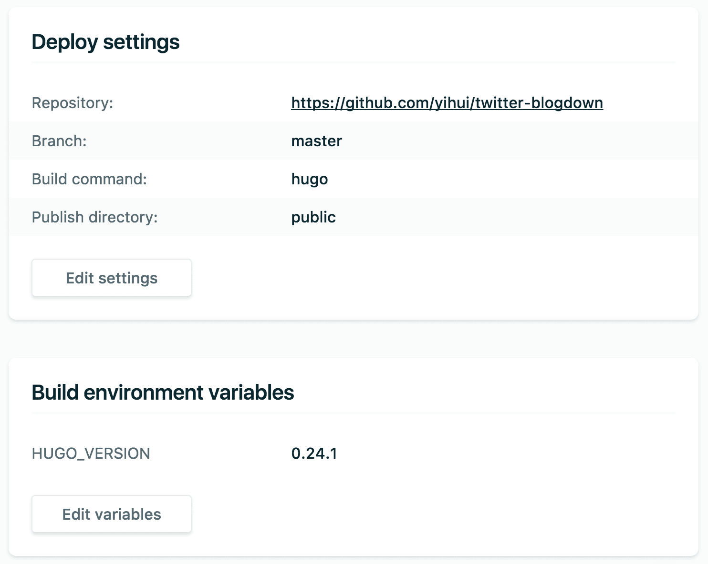

# Implementación

Dado que el sitio web es básicamente una carpeta que contiene archivos estáticos, es mucho más fácil de implementar que los sitios web que requieren lenguajes dinámicos en el servidor, como PHP o bases de datos. Todo lo que necesita es subir los archivos a un servidor, y generalmente su sitio web estará en funcionamiento en breve. La pregunta clave es qué servidor web quiere usar. Si no tiene su propio servidor, puede probar los que figuran en este capítulo. La mayoría de ellos son gratuitos (excepto Amazon S3), o al menos ofrecen planes gratuitos. Descargo de responsabilidad: los autores de este libro no están afiliados a ninguno de estos servicios o compañías, y no hay garantía de que estos servicios se presten para siempre.^[Puede encontrar fácilmente otros servicios similares si usa su motor de búsqueda].

Teniendo en cuenta el costo y la amabilidad de los principiantes, actualmente recomendamos Netlify (https://www.netlify.com). Proporciona un plan gratuito que en realidad tiene muchas funciones útiles. Si no tiene experiencia en publicar sitios web antes, solo inicie sesión con su cuenta GitHub u otras cuentas, arrastre la carpeta `public/` creada por **blogdown** para su sitio web a la página de Netlify, y su sitio web estará en línea en unos segundos con un nombre de subdominio aleatorio del formulario `random-word-12345.netlify.com` proporcionado por Netlify (puede personalizar el nombre). Puede automatizar fácilmente este proceso (consulte la sección \@ref(netlify) para obtener más información). Ya no necesita luchar con `ssh` o `rsync-zrvce`, si sabe lo que significan estos comandos.

La segunda solución más fácil puede ser Updog (https://updog.co), que cuenta con la integración de Dropbox. Publicar un sitio web puede ser tan fácil como copiar los archivos en la carpeta `public/` de su sitio web **blogdown** en una carpeta de Dropbox. El plan gratuito de Updog solo ofrece funciones limitadas, y su plan de pago le dará acceso a funciones mucho más ricas.

Si no le importa utilizar herramientas de línea de comandos o está familiarizado con GIT/GitHub, puede considerar servicios como GitHub Pages, Travis CI o Amazon S3 para construir o alojar sus sitios web. No importa qué servicio use, tenga en cuenta que ninguno de ellos realmente puede encerrarlo y siempre puede cambiar el servicio. Como mencionamos anteriormente, una gran ventaja de **blogdown** es que su sitio web será una carpeta de archivos estáticos que puede mover a cualquier servidor web.

## Netlify

Como acabamos de mencionar, Netlify\index{Netlify} le permite publicar rápidamente un sitio web cargando la carpeta `public/` a través de su interfaz web, y se le asignará un subdominio aleatorio `*.netlify.com`.^[Usted no tiene que mantener el dominio `*.netlify.com`. Consulte el apéndice \@ref(nombre de dominio) para obtener más información.] Este enfoque es bueno para los sitios web que no se actualizan con frecuencia (o no se actualizan). Sin embargo, es poco probable que no necesite actualizar su sitio web, por lo que presentamos un mejor enfoque en esta sección,^[Tenga en cuenta que el propósito de esta sección es describir los pasos básicos de la publicación de un sitio web con Netlify, y los detalles técnicos pueden cambiar de vez en cuando, por lo que la documentación oficial de Netlify debería ser la fuente más confiable si tiene alguna pregunta o si alguna de las cosas que presentamos aquí no funciona]. Le llevará unos minutos más completar las configuraciones. Una vez que está configurado correctamente, todo lo que necesita hacer en el futuro es actualizar el repositorio fuente, y Netlify llamará a Hugo para que haga su sitio web automáticamente.

Básicamente, debe alojar todos los archivos fuente de su sitio web en un repositorio GIT.^[Si el contenido de su sitio `blogdown` no está en el directorio raíz de su repositorio GIT, Netlify no se compilará.] No necesita poner el directorio `public/` bajo control de versión^[Puede agregar `public` a `.gitignore` para ignorarlo en GIT.] porque se generará automáticamente. Actualmente, Netlify admite repositorios GIT alojados en GitHub, GitLab y BitBucket. Con cualquiera de estas cuentas, puede iniciar sesión en Netlify desde su página de inicio y seguir la guía para crear un nuevo sitio desde su repositorio de GIT.

Netlify es compatible con varios generadores de sitios web estáticos, incluidos Jekyll y Hugo. Para un nuevo sitio, debe especificar un comando para construir su sitio web, así como también la ruta del directorio de publicación. Netlify también admite múltiples versiones de Hugo, por lo que el comando de compilación puede ser el `hugo` predeterminado. La versión predeterminada es 0.17, que es demasiado antigua. Le recomendamos que utilice al menos la versión 0.20. Para especificar una versión de Hugo mayor o igual a 0.20, debe crear una variable de entorno `HUGO_VERSION` en Netlify. Consulte la [documentación de Netlify](https://www.netlify.com/docs/continuous-deployment/) para obtener más información. El directorio de publicación debe ser `public` a menos que lo haya cambiado en su `config.toml`. La figura \@ref(fig: configuración-netlify) muestra la configuración del sitio web https://t.yihui.name. No tiene que seguir la configuración exacta para su propio sitio web; en particular, es posible que necesite cambiar el valor de la variable de entorno `HUGO_VERSION` a una versión reciente de Hugo.^[Para el momento en que se publique este libro, la versión 0.24.1 puede ser demasiado antigua.]

```{r netlify-settings, fig.cap='Configuraciones de ejemplo de un sitio web presentado en Netlify.', echo=FALSE, fig.align='center', out.width='100%'}

```

Puede tardar uno o dos minutos en implementar su sitio web en Netlify por primera vez, pero puede ser mucho más rápido más adelante (unos segundos) cuando actualice el origen de su sitio web, porque Netlify implementa cambios incrementales en el directorio `public/`, es decir, solo se despliegan los archivos más nuevos en comparación con la última vez.

Después de que su repositorio de GIT esté conectado con Netlify, el último problema que puede querer resolver es el nombre de dominio\index{nombre de dominio}, a menos que esté satisfecho con el subdominio gratuito de Netlify. Si desea utilizar un dominio diferente, debe configurar algunos registros DNS del dominio para dirigirlo al servidor de Netlify. Consulte el apéndice \@ref(nombre de dominio) para obtener información general sobre los nombres de dominio.

Si no está familiarizado con los nombres de dominio o no quiere aprender más sobre ellos, debe tener en cuenta un subdominio gratuito `* .rbind.io` ofrecido por RStudio, Inc. Visite el sitio web de soporte de Rbind <https://support.rbind.io> para aprender cómo solicitar un subdominio. De hecho, la organización Rbind también ofrece ayuda gratuita sobre cómo configurar un sitio web basado en **blogdown**, gracias a una gran cantidad de voluntarios de la comunidad de R y de estadística.

Netlify es la única solución en este capítulo que no requiere preinstalar su sitio web. Solo necesita actualizar los archivos fuente, enviarlos a GitHub y Netlify creará el sitio web para usted.^[Esto se denomina "implementación continua"]. El resto de las soluciones de este capítulo requerirán que cree su sitio web localmente. y cargue la carpeta `public/` explícita o implícitamente. Dicho esto, ciertamente puede preconstruir su sitio web utilizando cualquier herramienta, enviarlo a GitHub, y aún así Netlify lo implementará para usted. Lo que debe hacer es dejar el comando de compilación en blanco y decirle a Netlify su directorio de publicación (por ejemplo, `public/` por defecto de Hugo, pero si su sitio web preconstruido está bajo el directorio raíz, especifique `.` como el directorio de publicación). Entonces Netlify simplemente carga todos los archivos de este directorio a sus servidores sin reconstruir su sitio web.

## Updog

Updog (https://updog.co) proporciona\index{Updog} un servicio simple: convierte una carpeta de Dropbox (o Google Drive) especificada en un sitio web. La idea es que le conceda a Updog el permiso para leer la carpeta, y actuará como intermediario para mostrar sus archivos en esta carpeta a sus visitantes. Se debe acceder a esta carpeta a través de un nombre de dominio, y Updog ofrece un subdominio gratuito `*.updog.co`. Por ejemplo, si ha asignado el dominio `example.updog.co` a su carpeta de Dropbox, y un visitante desea ver la página `https://example.updog.co/foo/index.html`, Updog leerá el archivo `foo/index.html` en su carpeta de Dropbox y lo mostrará al visitante.

Por el momento, el plan gratuito de Updog solo permite un sitio web por cuenta e insertará un pie de página "Hosted on Updog" en sus páginas web. Puede que no le gusten estas limitaciones. La principal ventaja de usar Updog es que la publicación de un sitio web se vuelve implícita, ya que Dropbox sincronizará archivos continuamente. Todo lo que necesita hacer es asegurarse de que su sitio web se genere en la carpeta correcta de Dropbox. Esto se puede lograr fácilmente estableciendo la opción `publishDir` en `config.toml`. Por ejemplo, supongamos que la carpeta que asigna a Updog es `~/Dropbox/Apps/updog/my-website/`, y su carpeta fuente está en `~/Dropbox/Apps/updog/my-source/`, entonces puede establecer `publishDir: "../my-website"` en `~/Dropbox/Apps/updog/my-source/config.toml`.

También puede usar su nombre de dominio personalizado si no desea el subdominio Updog predeterminado, y solo necesita apuntar el registro CNAME de su nombre de dominio al subdominio Updog.^[Vea el apéndice \@ref(nombre de dominio) para obtener más información.]

## GitHub Pages

GitHub Pages (https://pages.github.com) \index{GitHub Pages} es una forma muy popular de alojar sitios web estáticos (especialmente los creados con Jekyll), pero sus ventajas no son obvias ni atractivas en comparación con Netlify. Le recomendamos que considere Netlify + Hugo debido a estas razones:

- Actualmente, GitHub Pages no es compatible con HTTPS para nombres de dominio personalizados. HTTPS solo funciona para los subdominios `*.github.io`. Esta limitación no existe en Netlify. Puede leer el artículo ["¿Por qué HTTPS para todo?"](https://https.cio.gov/everything/) para comprender por qué es importante y se le anima a activar HTTPS para su sitio web siempre que sea posible.

- Redirigir URLs es incómodo con GitHub Pages pero mucho más sencillo con Netlify.^[GitHub Pages utiliza un plugin Jekyll para escribir una metaetiqueta `HTTP-REFRESH` para redirigir páginas, y Netlify puede hacer redirecciones 301 o 302 basadas en patrones, que puede notificar a los motores de búsqueda que ciertas páginas se han movido (de forma permanente o temporal).] Esto es importante especialmente cuando tiene un sitio web antiguo que desea migrar a Hugo; algunos enlaces pueden estar rotos, en cuyo caso puede redireccionarlos fácilmente con Netlify.

- Una de las mejores características de Netlify que no está disponible en GitHub Pages es que Netlify puede generar un sitio web único para la vista previa cuando se envía un pull request de GitHub a su repositorio de GitHub. Esto es extremadamente útil cuando otra persona (o incluso usted mismo) propone cambios en su sitio web, ya que tiene la oportunidad de ver cómo se vería el sitio web antes de fusionar el pull request.

Básicamente, Netlify puede hacer todo lo que GitHub Pages puede, pero todavía hay una pequeña característica que falta, que está estrechamente vinculada a GitHub, que es GitHub [Project Pages.](https://help.github.com/articles/user-organization-and-project-pages/). Esta función le permite tener sitios web de proyectos en repositorios separados, por ejemplo, puede tener dos sitios web independientes `https://username.github.io/proj-a/` y `https://username.github.io/proj-b/`, que corresponde a los repositorios de GitHub `username/proj-a` y `username/proj-b`, respectivamente. Sin embargo, dado que puede conectar cualquier repositorio de GitHub con Netlify, y cada repositorio puede asociarse con un nombre de dominio o subdominio, puede reemplazar las páginas de proyecto de GitHub con diferentes subdominios como `proj-a.netlify.com` y `proj-b.netlify.com`. La limitación real es que no puede usar subcampos en la URL pero puede usar cualquier (sub)nombre de dominio.

Aunque GitHub no es compatible oficialmente con Hugo (solo es compatible con Jekyll), puede publicar cualquier archivo HTML estático en GitHub Pages, incluso si no están compiladas con Jekyll. El primer requisito para usar GitHub Pages es que debe crear un repositorio de GitHub llamado `username.github.io` debajo de su cuenta (reemplace `username` con su nombre de usuario GitHub real), y lo que queda es llevar los archivos de su sitio web a este repositorio. La documentación completa de GitHub Pages está en https://pages.github.com, y por favor ignore todo lo relacionado con Jekyll a menos que realmente use Jekyll en lugar de Hugo. Para asegurarse de que GitHub no reconstruya su sitio web utilizando Jekyll y simplemente publique los archivos que envía al repositorio, debe crear un archivo (oculto) llamado `.nojekyll` en el repositorio.^[Puede usar la función en R `file.create('.nojekyll')` para crear este archivo si no sabe cómo hacerlo.] GitHub ofrece un subdominio gratuito `username.github.io`, y puede usar su propio nombre de dominio configurando sus registros A o CNAME para apuntarlo a GitHub Pages (consulte la documentación de GitHub Pages para obtener instrucciones).

Su directorio `public/` debe ser el repositorio de GIT. Tienes dos opciones posibles para configurar este repositorio localmente. La primera opción es seguir la estructura predeterminada de un sitio web de Hugo como el siguiente diagrama e inicializar el repositorio de GIT bajo el directorio `public/`:

```bash
source/
│
├── config.toml
├── content/
├── themes/
├── ...
└── public/
    |
    ├── .git/
    ├── .nojekyll
    ├── index.html
    ├── about/
    └── ...
```

Si sabe cómo usar la línea de comandos, cambie el directorio de trabajo a `public/`, e inicialice el repositorio de GIT allí:

```bash
cd public
git init
git remote add origin https://github.com/username/username.github.io
```

La otra opción es clonar el repositorio de GitHub que creó en el mismo directorio que el origen de su sitio web:

```bash
git clone https://github.com/username/username.github.io
```

Y la estructura debería lucir más o menos así:

```bash
source/
│
├── config.toml
├── content/
├── themes/
└── ...

username.github.io/
│
├── .git/
├── .nojekyll
├── index.html
├── about/
└── ...
```

El directorio de origen y el directorio `username.github.io` están bajo el mismo directorio principal. En este caso, debe establecer la opción `publishDir: "../username.github.io"` en `source/config.toml`.

## Travis + GitHub

Si\index{Travis CI} decide no seguir nuestra recomendación de usar Netlify para implementar su sitio web, debemos advertirle que el enfoque de esta sección requerirá un conocimiento sustancial sobre GIT, GitHub, Travis CI (https://travis-ci.org), y la línea de comandos de Linux, que dejaremos que aprenda por su cuenta. La principal ventaja de publicar a través de Travis CI es que puede compilar todas sus publicaciones de Rmd en Travis CI (en la nube) en lugar de su computadora local.

En caso de que no esté familiarizado con Travis, este es un servicio de verificación continua de su software en una máquina virtual cada vez que haga push a cambios en GitHub. Es principalmente para probar software, pero dado que puede ejecutar muchos comandos en su máquina virtual, puede usar la máquina virtual para hacer otras cosas, por ejemplo, instalar R y el paquete **blogdown** para crear sitios web. Antes de mostrarle cómo, me gustaría mencionar dos cuestiones que debe tener en cuenta:

- Personalmente, prefiero echar un vistazo a la salida en GIT para ver los cambios cuando tengo cualquier salida que se calcula dinámicamente desde R, para que sepa con certeza qué voy a publicar exactamente. Con Travis, es algo impredecible porque es completamente automático y no tiene la oportunidad de ver el nuevo contenido o los resultados que se publicarán. Hay muchos factores que pueden afectar la construcción del sitio: la versión de R, la disponibilidad de ciertos paquetes en R, las dependencias del sistema y la conexión de red, etc.

- El tiempo requerido para compilar todos los archivos Rmd puede ser muy largo y causar tiempos de espera en Travis, dependiendo de cuánto tiempo consuma su código en R. Hay un mecanismo de almacenamiento en caché en **blogdown** para acelerar la construcción de su sitio (consulte la sección \@ref(métodos)), y si usa Travis para construir su sitio web, no se beneficiará de este mecanismo de almacenamiento en caché a menos que aproveche el almacenamiento en caché de Travis. Tiene que almacenar en caché los directorios `content/`, `static/`, y `blogdown/`, pero el caché de Travis es un poco frágil, en mi experiencia. Algunas veces la memoria caché puede ser purgada por razones desconocidas. Además, no puede almacenar en caché directamente `content/` y `static/`, porque Travis clona su repositorio antes de restaurar el caché, lo que significa que los archivos viejos del `content/` y `static/` almacenados en caché pueden sobrescribir los nuevos archivos que usted envió a GitHub.

El segundo problema se puede resolver, pero no quiero explicar cómo en este libro, ya que la solución es demasiado complicada. Si realmente desea usar Travis para construir su sitio web y encontrarse con este problema, puede presentar un issue en el repositorio de GitHub https://github.com/yihui/travis-blogdown. De hecho, este repositorio es un ejemplo mínimo que creé para mostrar cómo crear un sitio web en Travis y publicarlo en GitHub Pages.

La documentación de Travis muestra cómo implementar un sitio en GitHub Pages: https://docs.travis-ci.com/user/deployment/pages/, pero no muestra cómo crear un sitio. Aquí está el archivo de configuración de Travis, `.travis.yml`, para el repositorio `travis-blogdown`:

```yaml
language: r
dist: trusty
sudo: false

branches:
  only:
    - master

cache:
  packages: yes
  directories:
    - $HOME/bin

before_script:
  - "Rscript -e 'blogdown::install_hugo()'"

script:
  - "Rscript -e 'blogdown::build_site()'"

deploy:
  provider: pages
  skip_cleanup: true
  github_token: $GITHUB_TOKEN
  on:
    branch: master
  local_dir: public
  fqdn: travis-blogdown.yihui.name
```

La clave es que instalemos Hugo a través de `blogdown::install_hugo()` y construyamos el sitio a través de `blogdown::build_site()`. Para engañar a Travis para que cree este repositorio como un paquete en R, debe tener un archivo `DESCRIPTION` en el repositorio, de lo contrario, su sitio web no se compilará.

```yaml
Package: placeholder
Type: Website
Title: Does not matter.
Version: 0.0.1
Imports: blogdown
Remotes: rstudio/blogdown
```

Hay algunas cosas más que explicar y enfatizar en `.travis.yml`:

- La opción `branches` especifica que solo los cambios en la rama `master` activarán la construcción en Travis.

- La opción `cache` especifica todos los paquetes en R que se almacenarán en caché, por lo que la próxima vez será más rápido crear el sitio (no es necesario volver a instalar los paquetes en R desde el origen). El directorio `bin/` en el directorio de inicio también se almacena en caché porque Hugo está instalado allí, y la próxima vez que Hugo no necesite ser reinstalado.

- Para la opción `deploy`, hay una variable de entorno llamada `GITHUB_TOKEN`, y he especificado su valor para ser un token de acceso personal de GitHub a través de la configuración de Travis de este repositorio, para que Travis pueda escribir en mi repositorio después de que el sitio web está construido. La opción `on` especifica que la implementación solo ocurrirá cuando se construya la rama `master`. La opción `local_dir` es el directorio de publicación, que debe ser 'público' por defecto en Hugo. Por defecto, el sitio web se envía a la rama `gh-pages` de este repositorio. La opción `fqdn` especifica el dominio personalizado del sitio web. He establecido un registro CNAME (ver apéndice \@ref(nombre de dominio)) para apuntar `travis-blogdown.yihui.name` a `yihui.github.io`, para que GitHub pueda servir a este sitio web a través de este dominio (de hecho, Travis escribirá un archivo `CNAME` que contiene el dominio en la rama `gh-pages`).

Si utiliza el repositorio `username.github.io` en GitHub, el sitio web debe ser enviado a su rama `master` en lugar de `gh-pages` (esta es la única excepción). Recomiendo que separe el repositorio fuente y el repositorio de salida. Por ejemplo, puede tener un repositorio `website-source` con la misma configuración que el `.travis.yml` anterior, excepto dos nuevas opciones bajo `deploy`:

```yaml
deploy:
  ...
  repo: username/username.github.io
  target_branch: master
```

Esto significa que el sitio web será enviado a la rama `master` del repositorio `username/username.github.io` (recuerde reemplazar `username` con su nombre de usuario real).

También puede implementar su sitio web en Amazon S3\index{Amazon S3}, y la configuración desde R es muy similar a lo que hemos introducido para GitHub Pages. La única diferencia está en el último paso, donde cambia el destino de GitHub Pages a Amazon S3. Para obtener más información, consulte la documentación de Travis: https://docs.travis-ci.com/user/deployment/s3/.

## GitLab Pages

GitLab (http://gitlab.com) es una forma muy popular de alojar el código fuente de su proyecto. GitLab tiene un [servicio de Integración y Despliegue Integrado (CI/CD)](https://about.gitlab.com/features/gitlab-ci-cd/) que se puede usar para alojar sitios web estáticos, llamados [Páginas de GitLab ](https://about.gitlab.com/features/pages/). La principal ventaja de utilizar GitLab Pages es que podrá compilar todas sus publicaciones Rmd a través de su servicio CI/CD en lugar de su computadora local y cualquier contenido generado, como archivos HTML, se copiará automáticamente en el servidor web. Tenga en cuenta que este enfoque tiene problemas similares a los del enfoque Travis + GitHub en la sección \@ref(travis-github).

El servicio CI/CD de GitLab usa las instrucciones almacenadas en el archivo YAML `.gitlab-ci.yml` en el repositorio. Aquí hay un archivo de configuración de muestra `.gitlab-ci.yml` del repositorio de ejemplo https://gitlab.com/rgaiacs/blogdown-gitlab:

```yaml
image: debian:buster-slim

before_script:
  - apt-get update && apt-get -y install pandoc r-base
  - R -e "install.packages('blogdown',repos='http://cran.rstudio.com')"
  - R -e "blogdown::install_hugo()"

pages:
  script:
    - R -e "blogdown::build_site()"
  artifacts:
    paths:
      - public
  only:
    - master
```

La opción `image` especifica qué imagen de [Docker](https://www.docker.com) se usará como punto de inicio. Estamos utilizando una imagen de Debian, pero se puede usar cualquier imagen de [Docker Hub](https://hub.docker.com/). Otras configuraciones y opciones son similares a `.travis.yml` en la sección \@ref(travis-github). El ejemplo anterior genera el sitio web en https://rgaiacs.gitlab.io/blogdown-gitlab.