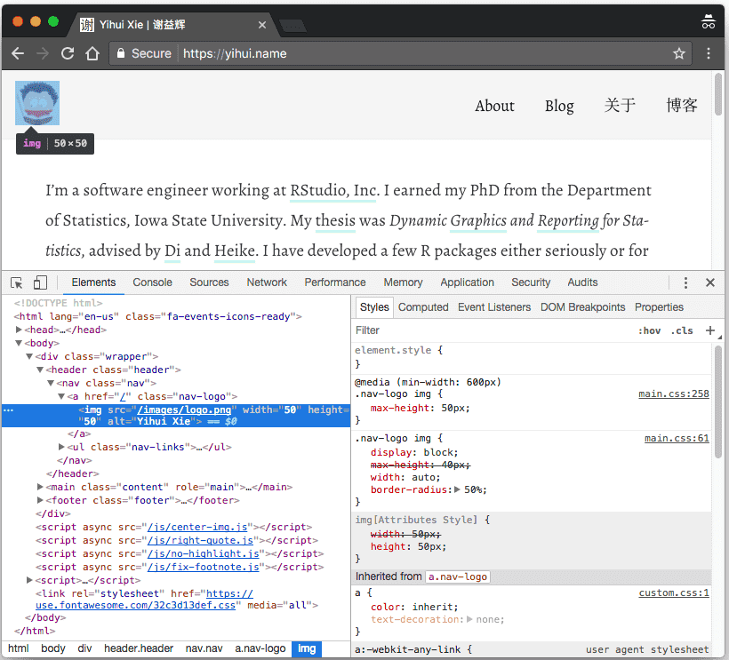

# Conceptos básicos de sitios web

Si desea ajustar el aspecto de su sitio web, o incluso diseñar su propio tema, debe tener algunos conocimientos básicos de desarrollo web. En este apéndice, presentamos brevemente HTML, CSS y JavaScript, que son los componentes más comunes de una página web, aunque CSS y JavaScript son opcionales.

Nuestro objetivo es comenzar con HTML, CSS y JavaScript. HTML es relativamente fácil de aprender, pero CSS y JavaScript pueden ser mucho más complicados, dependiendo de cuánto quiera aprender y qué quiera hacer con ellos. Después de leer este apéndice, deberá usar otros recursos para aprender. Cuando busca estas tecnologías en línea, los sitios web más probables a los que puede acceder son [MDN](https://developer.mozilla.org) (Mozilla Developer Network), [w3schools.com,](https://www.w3schools.com) y [StackOverflow.](https://stackoverflow.com). Entre estos sitios web, w3schools a menudo proporciona ejemplos simples y tutoriales que pueden ser más amigables para los principiantes, pero a menudo escuchamos [comentarios negativos](https://meta.stackoverflow.com/q/280478/559676) al respecto, por lo tanto, úselo con precaución. A menudo leo los tres sitios web cuando busco soluciones.

Si solo pudiéramos dar un consejo más útil sobre el desarrollo web, sería: use las herramientas de desarrollo de su navegador web. La mayoría de los navegadores web modernos ofrecen estas herramientas. Por ejemplo, puede encontrar estas herramientas en el menú de Google Chrome `Ver -> Desarrollador`, el menú de Firefox `Herramientas -> Desarrollador web`, o el menú 'Desarrollar -> Mostrar inspector web' de Safari. La figura \@ref(fig: chrome-devtools) es una captura de pantalla del uso de Herramientas de desarrollador en Chrome.

```{r chrome-devtools, fig.cap='Herramientas de desarrollador en Google Chrome.', fig.align='center', out.width='100%', echo=FALSE}

```

Por lo general, también puede abrir las Herramientas de desarrollo haciendo clic derecho en un elemento determinado en la página web y seleccionando la opción del menú `Inspeccionar` (o `Inspeccionar elemento`). En la figura \@ref(fig: chrome-devtools), hice clic derecho en la imagen de perfil de mi sitio web https://yihui.name y lo inspeccioné, y Chrome destacó su código fuente HTML `` en el panel izquierdo. También puede ver los estilos CSS asociados con este elemento `img` en el panel derecho. Además, puede cambiar los estilos de forma interactiva si conoce CSS y ver los efectos (temporales) en tiempo real en la página. Una vez que esté satisfecho con los nuevos estilos, puede escribir el código CSS en los archivos.

Hay muchas características increíbles de Herramientas de desarrollador, que las hacen no solo extremadamente útiles para la depuración y la experimentación, sino también útiles para el aprendizaje del desarrollo web. Estas herramientas son indispensables para mí cuando desarrollo algo relacionado con páginas web. Aprendí mucho sobre CSS y JavaScript jugando con estas herramientas.

## HTML

HTML\index{HTML} significa Hyper Text Markup Language, y es el lenguaje detrás de la mayoría de las páginas web que usted ve. Puede usar el menú `Ver -> Ver fuente` o el menú contextual `Ver fuente de página` para ver la fuente HTML completa de una página web en su navegador. Todos los elementos en una página están representados por etiquetas HTML. Por ejemplo, la etiqueta `<p>` representa párrafos, y `` representa imágenes.

Lo bueno de HTML es que el lenguaje tiene solo un número limitado de etiquetas, y el número no es muy grande (especialmente el número de etiquetas comúnmente utilizadas). Esto significa que hay esperanza de que pueda dominar este idioma de manera completa y rápida.

La mayoría de las etiquetas HTML aparecen en pares, con una etiqueta de apertura y una etiqueta de cierre, por ejemplo, `<p></p>`. Usted escribe el contenido entre las etiquetas de apertura y cierre, por ejemplo, `<p>Este es un párrafo.</ P>`. Hay algunas excepciones, como la etiqueta ``, que se puede cerrar con una barra inclinada `/` en la etiqueta de apertura, por ejemplo, ``. Puede especificar los atributos de un elemento en la etiqueta de apertura usando la sintaxis `name=value` (algunos atributos no requieren `value`).

Los documentos HTML a menudo tienen la extensión de nombre de archivo `.html` (o `.htm`). A continuación se muestra una estructura general de un documento HTML:

```html
<html>

  <head>
  </head>
  
  <body>
  </body>

</html>
```

Básicamente, un documento HTML consta de una sección `head` y `body`. Puede especificar los metadatos e incluir archivos como archivos CSS en la sección `head`. Normalmente, la sección `head` no está visible en una página web. Es la sección de 'cuerpo' que mantiene el contenido para mostrarse a un lector. A continuación se muestra un documento de ejemplo un poco más rico:

```html
<!DOCTYPE html>
<html>

  <head>
    <meta charset="utf-8" />
    
    <title>Your Page Title</title>
    
    <link rel="stylesheet" href="/css/style.css" />
  </head>
  
  <body>
    <h1>A First-level Heading</h1>
    
    <p>A paragraph.</p>
    
    
    
    <ul>
      <li>An item.</li>
      <li>Another item.</li>
      <li>Yet another item.</li>
    </ul>
    
    <script src="/js/bar.js"></script>
  </body>

</html>
```

En la cabecera, declaramos que la codificación de caracteres de esta página es UTF-8 a través de una etiqueta `<meta>`, especificamos el título mediante la etiqueta `<title>` e incluimos una hoja de estilo mediante una etiqueta `<link>`.

El cuerpo contiene un encabezado de sección de primer nivel `<h1>`,^[Hay seis niveles posibles de `h1`, `h2`, ..., a `h6`.] Un párrafo `<p>`, una imagen ``, una lista desordenada `<ul>` con tres elementos de lista `<li>`, e incluye un archivo JavaScript al final a través de `<script>`.

Hay tutoriales mucho mejores en HTML que esta sección, como los que ofrecen MDN y w3schools.com, por lo que no vamos a hacer de esta sección un tutorial completo. En cambio, solo queremos brindar algunos consejos sobre HTML:

- Puede validar su código HTML a través de este servicio: https://validator.w3.org. Este validador señalará posibles problemas de su código HTML. En realidad, también funciona para documentos XML y SVG.

- Entre todos los atributos de HTML, las rutas de archivos (el atributo `src` de algunas etiquetas como ``) y los enlaces (el atributo `href` de la etiqueta `<a>`) pueden ser las más confusas para los principiantes. Las rutas y los enlaces pueden ser relativos o absolutos, y pueden venir con o sin el protocolo y el dominio. Tiene que entender a qué apunta exactamente un enlace o una ruta. Un enlace completo tiene la forma `http://www.example.com/foo/bar.ext`, donde `http` especifica el protocolo (puede tratarse de otros protocolos como `https` o `ftp`), `www.example.com` es el dominio, y `foo/bar.ext` es el archivo debajo del directorio raíz del sitio web.

    - Si se refiere a recursos en el mismo sitio web (el mismo protocolo y dominio), le recomendamos que omita el protocolo y los nombres de dominio, para que los enlaces continúen funcionando incluso si cambia el protocolo o dominio. Por ejemplo, un enlace `<a href="/hi/there.html">` en una página `http://example.com/foo/` hace referencia a `http://example.com/hi/there.html`. No importa si cambia `http` a `https`, o `example.com` a `another-domain.com`.

    - Dentro del mismo sitio web, un enlace o ruta puede ser relativa o absoluta. El significado de una ruta absoluta no cambia sin importar dónde se coloca el archivo HTML actual, pero el significado de una ruta relativa depende de la ubicación del archivo HTML actual. Supongamos que está viendo la página `example.com/hi/there.html`:

    - Una ruta absoluta `/foo/bar.ext` siempre significa `example.com/foo/bar.ext`. La barra diagonal significa el directorio raíz del sitio web.

    - Una ruta relativa `../images/foo.png` significa `example.com/images/foo.png` (`..` significa subir un nivel). Sin embargo, si el archivo HTML `there.html` se mueve a `example.com/hey/again/there.html`, esta ruta en `there.html` se referirá a `example.com/hey/images/foo.png`.

    - Cuando decida si usar rutas relativas o absolutas, aquí está la regla general: si no va a mover los recursos referidos o vinculados de un subpath a otro (por ejemplo, de `example.com/foo/` a `example.com/bar/`), pero solo mueve las páginas HTML que usan estos recursos, usa rutas absolutas; Si desea cambiar el subpaso de la URL de su sitio web, pero las ubicaciones relativas de los archivos HTML y los recursos que utilizan no cambian, puede usar enlaces relativos (por ejemplo, puede mover todo el sitio web de `example.com/` a `example.com/foo/`).

    - Si los conceptos anteriores parecen demasiado complicados, una mejor manera es pensar detenidamente sobre la estructura de su sitio web y evitar mover archivos, o usar reglas de redireccionamientos si son compatibles (como los redireccionamientos 301 o 302).

    - Si enlaza a un sitio web o página web diferente, debe incluir el dominio en el enlace, pero puede no ser necesario incluir el protocolo, por ejemplo, `//test.example.com/foo.css` es un ruta válida. El protocolo real de esta ruta coincide con el protocolo de la página actual, por ejemplo, si la página actual es `https://example.com/`, este enlace significa `https://test.example.com/foo.css`. Puede ser beneficioso omitir el protocolo porque los recursos HTTP no se pueden incrustar en páginas servidas a través de HTTPS (por razones de seguridad), por ejemplo, una imagen en `http://example.com/foo.png` no se puede incrustar en una página `https://example.com/hi.html` via ``, pero `` funcionará si se puede acceder a la imagen a través de HTTPS, es decir, `https://example.com/foo.png`. El principal inconveniente de no incluir el protocolo es que tales enlaces y rutas no funcionan si abre el archivo HTML localmente sin usar un servidor web, por ejemplo, solo haga doble clic en el archivo HTML en su buscador de archivos y muéstrelo en el navegador.^[Eso es porque sin un servidor web, un archivo HTML se ve a través del protocolo `archivo`. Por ejemplo, puede ver una URL del formulario `file://ruta/al/archivo.html` en la barra de direcciones de su navegador. La ruta `//example.com/foo.png` se interpretará como `file://example.com/foo.png`, que es poco probable que exista como un archivo local en su computadora.]

    - Un error muy común que las personas cometen es poner un enlace sin las dobles barras delanteras delante del dominio. Puede pensar que `www.example.com` es un enlace válido. ¡No lo es! Al menos no se vincula al sitio web al que desea vincularse. Funciona cuando lo escribe en la barra de direcciones de su navegador porque su navegador normalmente lo autocompletará en `http://www.example.com`. Sin embargo, si escribe un enlace `<a href="www.example.com">Vea este enlace</a>`, tendrá problemas. El navegador interpretará esto como un enlace relativo, y es relativo a la URL de la página web actual, por ejemplo, si actualmente está viendo `http://yihui.name/cn/`, el enlace `www.example.com` en realidad significa `http://yihui.name/cn/www.example.com`! Ahora debería conocer el texto de Markdown `[Link](www.example.com)` suele ser un error, a menos que realmente quiera vincular un subdirectorio de la página actual o un archivo con literalmente el nombre `www.example.com`.

## CSS

El lenguaje Cascading Stylesheets \index{CSS} (CSS) se utiliza para describir el aspecto y el formato de los documentos escritos en HTML. CSS es responsable del estilo visual de su sitio. CSS es muy divertido de jugar, pero también puede robar tu tiempo fácilmente.

En el marco de Hugo (https://gohugo.io/tutorials/creating-a-new-theme/), CSS es uno de los principales archivos "sin contenido" que da forma a la apariencia de su sitio (los otros son imágenes, JavaScript y plantillas Hugo). ¿Qué significa el ["aspecto y tacto"](https://en.wikipedia.org/wiki/Look_and_feel) de un sitio? "Buscar" generalmente se refiere a componentes de estilo estático que incluyen, entre otros,

* paltetas de color,
* imágenes,
* diseños/márgenes, y
* fuentes.

mientras que "sentir" se relaciona con componentes dinámicos con los que el usuario interactúa como

* menús desplegables,
* botones, y
* formas.

Hay 3 formas de definir estilos. El primero está en línea con HTML. Por ejemplo, este código

```html
<p>Marco! <em>Polo!</em></p> 
```

produciría texto que se parece a esto: Marco! _Polo!_

Sin embargo, este método generalmente no es preferido para [razones numerosas.](https://stackoverflow.com/q/12013532/559676)

Una segunda forma es definir internamente el CSS colocando una sección de estilo en su HTML:

```html
<html>
<style> 
#favorite {
    font-style: italic;
}
</style>
<ul id="tea-list">
  <li>Earl Grey</li>
  <li>Darjeeling</li>
  <li>Oolong</li>
  <li>Chamomile</li>
  <li id="favorite">Chai</li>
</ul>
</html>
```

En este ejemplo, solo el último té enumerado, _Chai_, está en cursiva.

El tercer método es el más popular porque es más flexible y el menos repetitivo. En este método, usted define el CSS en un archivo externo que luego se referencia como un enlace en su HTML:

```html
<html>
    <link rel="stylesheet" href="/css/style.css" />
</html>
```

Lo que va dentro del documento CSS vinculado es esencialmente una lista de reglas (la misma lista podría aparecer internamente entre las etiquetas de estilo, si está utilizando el segundo método). Cada regla debe incluir un selector o un grupo de selectores, y un bloque de declaraciones dentro de llaves que contenga uno o más pares `property: value;`. Aquí está la [estructura general para una regla](https://developer.mozilla.org/en-US/docs/Web/CSS/Reference):

```css
/* CSS pseudo-code */
selectorlist {
    property: value;
    /* more property: value; pairs*/
}
```

Los [selectores](https://developer.mozilla.org/en-US/docs/Web/CSS/Reference#Selectors) pueden basarse en tipos o atributos de elementos HTML, como `id` o `class` (y combinaciones de estos atributos):

```css
/* by element type */
li { 
    color: yellow; /* all <li> elements are yellow */
}

/* by ID with the # symbol */
#my-id { 
    color: yellow; /* elements with id = "my-id" are yellow */
}

/* by class with the . symbol */
.my-class { 
    color: yellow; /* elements with class = "my-class" are yellow  */
}
```

Debido a que cada elemento HTML puede coincidir con varios selectores diferentes, el estándar CSS determina qué conjunto de reglas tiene prioridad para cualquier elemento dado y qué propiedades heredar. Aquí es donde el algoritmo de cascada entra en juego. Por ejemplo, tome una lista desordenada simple:

```html
<ul id="tea-list">
  <li>Earl Grey</li>
  <li>Darjeeling</li>
  <li>Oolong</li>
  <li>Chamomile</li>
  <li>Chai</li>
</ul>
```

Ahora, digamos que queremos resaltar nuestros tés favoritos nuevamente, así que usaremos un atributo de clase.

```html
<ul id="tea-list">
  <li>Earl Grey</li>
  <li class="favorite">Darjeeling</li>
  <li>Oolong</li>
  <li>Chamomile</li>
  <li class="favorite">Chai</li>
</ul>
```

Podemos usar este atributo de clase como un selector en nuestro CSS. Digamos que queremos que nuestros tés favoritos estén en negrita y tengan un color de fondo amarillo, por lo que nuestro CSS se vería así:

```css
.favorite {
  font-weight: bold;
  background-color: yellow;
}
```

Ahora, si desea que cada elemento de la lista se ponga en cursiva con un fondo blanco, puede configurar otra regla:

```css
li { 
  font-style: italic;
  background-color: white;
}
```

Si juega con este código (que puede usar fácilmente usando sitios como http://jsbin.com, https://jsfiddle.net o https://codepen.io/pen/), verá que el segundo té favorito sigue resaltado en amarillo. Esto se debe a que la regla de CSS sobre `.favorite` como clase es más específica que la regla sobre elementos de tipo `li`. Para anular la regla `.favorite`, debe ser tan específico como sea posible al elegir su grupo de selectores:

```css
ul#tea-list li.favorite {
  background-color: white;
}
```

Este ejemplo solo araña la superficie de [cascada y herencia.](https://developer.mozilla.org/en-US/docs/Learn/CSS/Introduction_to_CSS/Cascade_and_inheritance)

Para cualquier tema de Hugo que instale, puede encontrar el archivo CSS en la carpeta `themes/`. Por ejemplo, el tema predeterminado de litio se encuentra en: `themes/hugo-lithium-theme/static/css/main.css`. Una vez que esté familiarizado con CSS, puede comprender cómo funciona cada conjunto de reglas para dar forma al estilo visual de su sitio web, y cómo modificar las reglas. Para algunos temas (es decir, el [tema académico](https://github.com/gcushen/hugo-academic)), tiene la opción de vincular a un [CSS personalizado](https://gist.github.com/gcushen/d5525a4506b9ccf83f2bce592a895495) que puede utilizar para personalizar aún más el estilo visual de su sitio.

Algunos ejemplos de una línea ilustran cómo las simples reglas de CSS se pueden usar para hacer cambios dramáticos:

- Para hacer imágenes circulares o redondeadas, puede asignar una clase `img-circle` a imágenes (e.g., ``) y definir el CSS:

    ```css
    .img-circle {
      border-radius: 50%;
    }
    ```

- Para hacer tablas de rayas, puede agregar colores de fondo a las filas impares o pares de la tabla, e.g.,

    ```css
    tr:nth-child(even) {
      background: #eee;
    }
    ```

- Puede agregar o anteponer contenido a elementos a través de pseudo-elementos `::after` y `::before`. Aquí hay un ejemplo de cómo agregar un período después de los números de sección: https://github.com/rstudio/blogdown/issues/80.

## JavaScript

Es mucho más difícil introducir JavaScript \index{JavaScript} que HTML y CSS, ya que es un lenguaje de programación. Hay muchos libros y tutoriales sobre este idioma. De todos modos, intentaremos arañar la superficie para los usuarios R en esta sección.

En pocas palabras, JavaScript es un lenguaje que generalmente se utiliza para manipular elementos en una página web. Una forma efectiva de aprender es a través de la consola de JavaScript en las Herramientas de Desarrollador de su navegador web (vea la Figura \@ref(fig: chrome-devtools)), porque puede escribir código de manera interactiva en la consola y ejecutarlo, lo cual se siente similar para ejecutar el código en R en la consola de R (por ejemplo, en RStudio). Puede abrir cualquier página web en su navegador web (por ejemplo, <https://yihui.name>), luego abrir la consola de JavaScript y probar el siguiente código en cualquier página web:

```js
document.body.style.background = 'orange';
```

Debería cambiar el color de fondo de la página a naranja, a menos que la página ya haya definido los colores de fondo para ciertos elementos.

Para usar JavaScript de manera efectiva, debe aprender tanto la sintaxis básica de JavaScript como la forma de seleccionar elementos en una página antes de poder manipularlos. Puede aprender parcialmente lo primero a partir del fragmento corto de JavaScript a continuación:

```js
var x = 1;  // assignments
1 + 2 - 3 * 4 / 5;  // arithmetic

if (x < 2) console.log(x);  // "print" x

var y = [9, 1, 0, 2, 1, 4];  // array

// function
var sum = function(x) {
  var s = 0;
  // a naive way to compute the sum
  for (var i=0; i < x.length; i++) {
    s += x[i];
  }
  return s;
};

sum(y);

var y = "Hello World";
y = y.replace(" ", ", ");  // string manipulation
```

Puede sentir que la sintaxis es similar a R hasta cierto punto. JavaScript es un lenguaje orientado a objetos, y generalmente hay varios métodos que puede aplicar a un objeto. La manipulación de cadena anterior es un ejemplo típico de la sintaxis `Object.method()`. Para conocer los métodos posibles en un objeto, puede escribir el nombre del objeto en su consola JavaScript seguido de un punto, y debería ver todos los candidatos.

Los usuarios de R deben ser extremadamente cautelosos porque los objetos JavaScript a menudo son mutables, lo que significa que un objeto puede ser modificado en cualquier lugar. A continuación, hay un ejemplo rápido:

```js
var x = {"a": 1, "b": 2};  // como una lista en R
var f = function(z) {
  z.a = 100;
};
f(x);
x;  // modificado! x.a es 100 ahora
```

Hay muchas librerías maduras de JavaScript que pueden ayudarlo a seleccionar y manipular elementos en una página, y la más popular puede ser\index{jQuery} [jQuery.](https://jquery.com) Sin embargo, debe saber que a veces probablemente puede hacerlo lo suficientemente bien sin estas librerías de terceros. Hay algunos métodos básicos para seleccionar elementos, como `document.getElementById()` y `document.getElementsByClassName()`. Por ejemplo, puede seleccionar todos los párrafos usando `document.querySelectorAll('p')`.

A continuación mostramos una aplicación ligeramente avanzada, en la que verá funciones anónimas, selección de elementos por nombres de etiquetas HTML, expresiones regulares y manipulación de elementos HTML.

En la sección \@ref(how-to), mencionamos cómo habilitar MathJax\index{MathJax} en un sitio web de Hugo. La parte fácil es incluir el script `MathJax.js` a través de una etiqueta `<script>`, y hay dos partes difíciles:

1. Cómo proteger el contenido matemático del motor de reducción (Blackfriday), por ejemplo, necesitamos asegurarnos de que los subrayados en las expresiones matemáticas no se interpreten como `<em></em>`. Este problema solo existe en las publicaciones simples de Markdown, y se ha mencionado en la sección \@ref(formato-de-salida) sin explicar la solución.

1. Por defecto, MathJax no reconoce un par de signos de pesos como la sintaxis de las expresiones matemáticas en línea, pero la mayoría de los usuarios se sienten más cómodos con la sintaxis `$x$` que con `\(x\)`.

La solución más fácil para el primer problema puede ser la adición de retrocesos alrededor de las expresiones matemáticas, por ejemplo, `` `$x_i$` ``, pero la consecuencia es que la expresión matemática se representará en `<code></code>`, y MathJax ignora las etiquetas `<code>` cuando busca expresiones matemáticas en la página. Podemos obligar a MathJax a buscar expresiones matemáticas en `<code>`, pero esto seguirá siendo problemático. Por ejemplo, alguien puede querer mostrar el código en línea R `` `list$x$y` ``, y `$x$` puede reconocerse como una expresión matemática. MathJax ignora `<code>` por buenas razones. Incluso si no tiene esas expresiones en `<code>`, puede tener algunos estilos CSS especiales adjuntos a `<code>`, y estos estilos se aplicarán a sus expresiones matemáticas, que pueden ser no deseadas (por ejemplo, una luz fondo gris).

Para resolver estos problemas, proporcioné una solución en el código JavaScript en https://yihui.name/js/math-code.js:

```js
(function() {
  var i, text, code, codes = document.getElementsByTagName('code');
  for (i = 0; i < codes.length;) {
    code = codes[i];
    if (code.parentNode.tagName !== 'PRE' &&
        code.childElementCount === 0) {
      text = code.textContent;
      if (/^\$[^$]/.test(text) && /[^$]\$$/.test(text)) {
        text = text.replace(/^\$/, '\\(').replace(/\$$/, '\\)');
        code.textContent = text;
      }
      if (/^\\\((.|\s)+\\\)$/.test(text) ||
          /^\\\[(.|\s)+\\\]$/.test(text) ||
          /^\$(.|\s)+\$$/.test(text) ||
          /^\\begin\{([^}]+)\}(.|\s)+\\end\{[^}]+\}$/.test(text)) {
        code.outerHTML = code.innerHTML;  // remove <code></code>
        continue;
      }
    }
    i++;
  }
})();
```

No es una solución perfecta, pero debería ser muy raro que tenga problemas. Esta solución identifica posibles expresiones matemáticas en `<code>`, y elimina la etiqueta `<code>`, por ejemplo, reemplaza `<code>$x$</code>` con `\(x\)`. Después de que se ejecuta este script, cargamos el script MathJax. De esta forma, no necesitamos obligar a MathJax a buscar expresiones matemáticas en las etiquetas `<code>`, y sus expresiones matemáticas no heredarán ningún estilo de `<code>`. El código de JavaScript anterior no es demasiado largo y debe ser autoexplicativo. La parte más difícil es `i++`. Dejaré que los lectores descubran por qué el bucle `for` no es la forma habitual` for(i = 0; i <codes.length; i ++)`. Me tomó unos minutos darme cuenta de mi error cuando escribí el ciclo en la forma habitual.

## Recursos útiles

### Organización de archivos

Aunque los sitios web estáticos de \index{Optimización} son rápidos en general, ciertamente puede optimizarlos aún más. Puede buscar "minificador de CSS y JavaScript", y estas herramientas pueden comprimir sus archivos CSS y JavaScript, de modo que puedan cargarse más rápido. Como hay muchas herramientas, no las recomendaré aquí.

También puede optimizar imágenes en su sitio web. Frecuentemente uso una herramienta de línea de comandos llamada [`optipng`](http://optipng.sourceforge.net) para optimizar las imágenes PNG. Es un optimizador sin pérdida, lo que significa que reduce el tamaño del archivo de una imagen PNG sin pérdida de calidad. Desde mi experiencia, funciona muy bien en imágenes PNG generadas a partir de R, y puede reducir el tamaño del archivo en al menos un 30% (a veces incluso más del 50%). Personalmente también uso herramientas en línea como http://optimizilla.com para optimizar imágenes PNG y JPEG. Para imágenes GIF, a menudo uso https://ezgif.com/optimize para reducir el tamaño de los archivos si son demasiado grandes.

Tenga en cuenta que Netlify ha proporcionado las funciones de optimización en el servidor de forma gratuita en este momento, por lo que es posible que desee habilitarlos allí en lugar de hacer todo el trabajo por su cuenta.

### Ayudando a las personas a encontrar su sitio

Una vez que su sitio esté en funcionamiento, es probable que desee que las personas lo encuentren. SEO --- Search Engine Optimization --- es el arte de hacer que un sitio web sea fácil de entender para los motores de búsqueda como Google. Y, con suerte, si el motor de búsqueda sabe de lo que está escribiendo, presentará enlaces a su sitio con altos resultados cuando alguien busque los temas que cubre.

Se han escrito libros completos sobre SEO, sin mencionar las muchas empresas que se dedican a ofrecer asesoramiento técnico y estratégico (pagado) para ayudar a que los sitios estén en la cima de los rankings de los motores de búsqueda. Si está interesado en obtener más información, un buen lugar para comenzar es la Guía de inicio de la optimización del motor de búsqueda de Google (http://bit.ly/google-seo-starter). A continuación hay algunos puntos clave:

1. El título que seleccione para cada página y publicación es una señal muy importante para Google y otros motores de búsqueda que les dicen de qué se trata esa página.

1. Las etiquetas de descripción también son fundamentales para explicar de qué se trata una página. En documentos HTML, [etiquetas de descripción](https://www.w3schools.com/tags/tag_meta.asp) son una forma de proporcionar metadatos sobre la página. Con **blogdown**, la descripción puede terminar como texto debajo del título de la página en un resultado de motor de búsqueda. Si el YAML de su página no incluye una descripción, puede agregar uno como `description:"Una breve descripción de esta página."`; la fuente HTML de la página renderizada tendría una etiqueta `<meta>` en `<head>` como `<meta name="description" content=" Una breve descripción de esta página.">`. No todos los temas admiten agregar la descripción a su página HTML (¡aunque deberían!)

1. La estructura de URL también es importante. Desea que el slug de su publicación tenga palabras clave informativas, lo que le da otra señal de lo que trata la página. ¿Tiene una publicación con cosas interesantes que hacer en San Francisco? `san-francisco-events-calendar` podría ser un mejor slug que `my-guide-to-fun-things-to-do`.