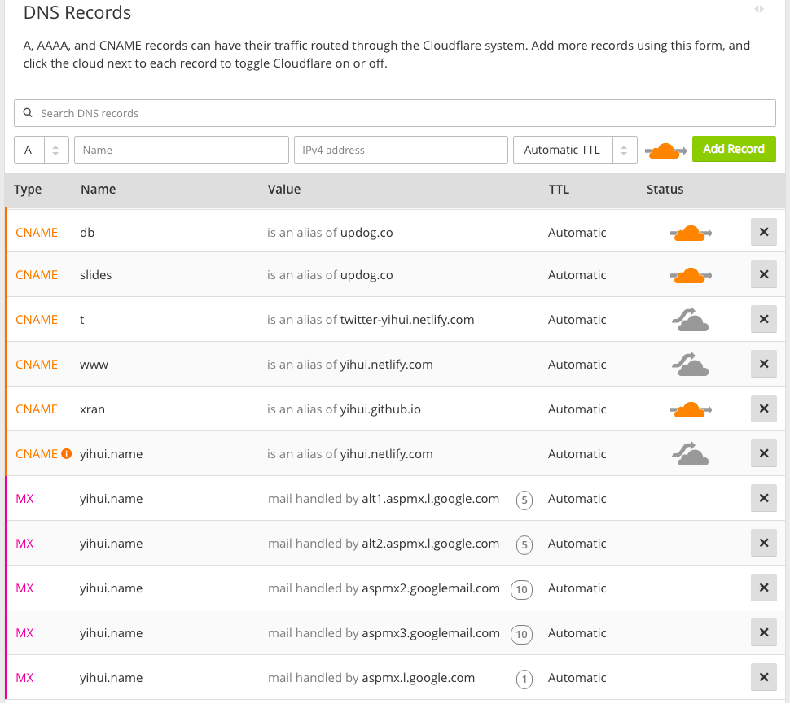

# Nombre de dominio

Si bien puede usar los nombres de subdominio gratuitos \index{Nombre de dominio} como los provistos por GitHub o Netlify, puede ser una mejor idea tener un nombre de dominio propio. El costo de un dominio principal es mínimo (por lo general, el costo anual es de alrededor de US$ 10), y usted ingresará a un mundo mucho más rico después de comprar un nombre de dominio. Por ejemplo, puede colocar su dominio en cualquier servidor web, puede crear tantos nombres de subdominios como desee e incluso puede configurar sus propias cuentas de correo electrónico usando el dominio o los subdominios. En este apéndice, explicaremos algunos conceptos básicos de nombres de dominio y mencionaremos algunos servicios (gratuitos) para ayudarlo a configurar su nombre de dominio.

Antes de sumergirnos en los detalles, queremos delinear la gran imagen de cómo funciona una URL en su navegador web. Supongamos que escribió o hizo clic en un enlace `http://www.example.com/foo/index.html` en su navegador web. ¿Qué sucede tras bambalinas antes de ver la página web real?

Primero, el nombre de dominio debe ser resuelto a través de los servidores de nombres asociados con él. Un servidor de nombres conoce los registros DNS (Sistema de nombres de dominio) de un dominio. Por lo general, buscará los "registros A" para señalar el dominio a la dirección IP de un servidor web. Existen muchos otros tipos de registros DNS, y los explicaremos más adelante. Una vez que se llega al servidor web, el servidor buscará el archivo `foo/index.html` debajo de un directorio asociado con el nombre de dominio, y devolverá su contenido en la respuesta. Eso es básicamente cómo puedes ver una página web.

## Registro

Puede comprar un nombre de dominio de muchos registradores de nombres de dominio. Para permanecer neutral, no vamos a hacer recomendaciones aquí. Puede usar su buscador para buscar un registrador por su cuenta, o pedirle recomendaciones a sus amigos. Sin embargo, nos gustaría recordarle algunas cosas a las que debe prestar atención cuando busque un registrador de nombres de dominio:

- Debería tener la libertad de transferir su dominio del registrador actual a otros registradores, es decir, no deberían bloquearlo en su sistema. Para transferir un nombre de dominio, se le debe dar un código conocido como "Código de transferencia de autenticación" o "Código de autenticación" o "Clave de transferencia" o algo por el estilo.

- Debería poder personalizar los servidores de nombres (consulte la sección \@ref(nombres-de-servidores)) de su dominio. De forma predeterminada, cada registrador le asignará sus propios nombres de servidores, y estos nombres de servidores generalmente funcionan muy bien. Sin embargo, hay algunos nombres de servidores especiales que proporcionan servicios más que solo registros DNS, y puede que esté interesado en usarlos.

- Otras personas pueden buscar libremente su información personal, como su correo electrónico o dirección postal, después de registrar un dominio y enviar esta información al registrador. Esto se denomina "WHOIS Lookup". Es posible que desee proteger su privacidad, pero su registrador puede requerir un pago adicional.

## Nombres de servidores

La razón principal por la que necesitamos nombres de servidores \index{Nombres de servidores} es que queremos usar dominios en lugar de direcciones IP, aunque un dominio no es estrictamente necesario para que pueda acceder a un sitio web. Puede usar la dirección IP si tiene su propio servidor con una IP pública, pero hay muchos problemas con este enfoque. Por ejemplo, las direcciones IP son limitadas (en particular, la IPv4), no son fáciles de memorizar y solo puede alojar un sitio web por dirección IP (sin utilizar otros puertos).

Un nombre de servidor de nombres es un motor que dirige los registros DNS de su dominio. El registro DNS más común es el registro A, que asigna un dominio a una dirección IP, de modo que el servidor de alojamiento se puede encontrar a través de su dirección IP cuando se accede a un sitio web a través de un dominio. Presentaremos dos tipos más de registros DNS en la sección \@ref(registros-dns): registros CNAME y MX.

En la mayoría de los casos, los nombres de servidores predeterminados provistos por el registrador de su dominio deberían ser suficientes, pero falta una tecnología especial en la mayoría de nombres de servidores: aplanamiento CNAME. Solo necesita esta tecnología si desea establecer un registro CNAME para su dominio apex. El único caso de uso que yo sepa es cuando aloja su sitio web a través de Netlify, pero desea utilizar el dominio Apex en lugar del subdominio `www`, por ejemplo, si desea usar `example.com` en lugar de `www.example.com`. Para hacer uso de esta tecnología, podría considerar [Cloudflare,](https://www.cloudflare.com) que proporciona esta característica DNS de forma gratuita. Básicamente, todo lo que necesita hacer es apuntar los servidores de nombres de su dominio a los servidores de nombres proporcionados por Cloudflare (de la forma `*.ns.cloudflare.com`).

## Resgistro DNS

Hay muchos tipos de registros DNS \index{registros-dns}, y es posible que vea una lista completa en [Wikipedia.](https://en.wikipedia.org/wiki/List_of_DNS_record_types). Los tipos más comúnmente utilizados pueden ser A, CNAME y registros MX. La figura \@ref(fig: cloudflare-dns) muestra un subconjunto de registros DNS de mi dominio `yihui.name` en Cloudflare, lo que puede darle una idea de cómo son los registros DNS. Puede consultar registros DNS utilizando herramientas de línea de comandos como [`dig`](https://en.wikipedia.org/wiki/Dig_(command)) o una aplicación proporcionada por Google: https://toolbox.googleapps.com/apps/dig/.

```{r cloudflare-dns, fig.cap='Algunos registros DNS del dominio yihui.name en Cloudflare.', fig.align='center', out.width='100%', echo=FALSE}

```

Un dominio apex puede tener cualquier cantidad de subdominios. Puede establecer registros DNS para el dominio apex y cualquier subdominio. Puede ver en  la figura \@ref(fig: cloudflare-dns) que tengo varios subdominios, por ejemplo, `slides.yihui.name` y `xran.yihui.name`.

Como hemos mencionado, un registro A señala un dominio o subdominio a una dirección IP del servidor host. No utilicé ningún registro A para mis dominios, ya que todos los servicios que uso, como Updog, GitHub Pages y Netlify, son compatibles con los registros CNAME. Un registro CNAME \index{CNAME Record} es un alias que señala un dominio a otro. La ventaja de utilizar CNAME sobre A es que no tiene que vincular un dominio a una dirección IP fija. Por ejemplo, el registro CNAME para `t.yihui.name` es `twitter-yihui.netlify.com`. Este último dominio es proporcionado por Netlify, y no necesito saber dónde alojan realmente el sitio web. Son libres de mover el host de `twitter-yihui.netlify.com`, y no necesitaré actualizar mi registro de DNS. Cada vez que alguien visita el sitio web `t.yihui.name`, el navegador web enrutará el tráfico al dominio establecido en el registro CNAME. Tenga en cuenta que esto es diferente de la redirección, es decir, que la URL `t.yihui.name` no se redirigirá explícitamente a `twitter-yihui.netlify.com` (aún se ve la primera en la barra de direcciones de su navegador).

Normalmente, puede establecer cualquier registro DNS para el dominio Apex, excepto CNAME, pero configuré un registro CNAME para mi dominio Apex `yihui.name`, y esto se debe a que Cloudflare admite el aplanamiento CNAME. Para obtener más información sobre este tema, puede leer la publicación ["WWW o no WWW,"](https://www.netlify.com/blog/2017/02/28/to-www-or-not-www /) por Netlify. Personalmente, prefiero no usar el subdominio `www.yihui.name` para mantener mis URL cortas, así que establezco un registro CNAME tanto para el dominio principal `yihui.name` como para el subdominio `www`, y Netlify redirigirá automáticamente el `www` subdominio al dominio apex. Dicho esto, si es un principiante, puede ser un poco más fácil configurar y usar el subdominio `www`, como lo sugiere Netlify. Tenga en cuenta que `www` es un subdominio convencional que suena como un dominio de apex, pero realmente no lo es; puede seguir esta convención o no como lo desee.

Para los servicios de correo electrónico, llegué lo suficientemente temprano ["cibernauta",](https://en.wikipedia.org/wiki/Netizen) y cuando registré mi nombre de dominio, Google todavía ofrecía servicios gratuitos de correo electrónico a propietarios de dominios personalizados. Así es como puedo tener un buzón personalizado `xie@yihui.name`. Ahora tendrá que pagar por [G Suite.](https://gsuite.google.com) En la figura \@ref(fig: cloudflare-dns) puede ver que he configurado algunos MX (siglas en inglés de "intercambio de correo") registros que apuntan a algunos servidores de correo de Google. Por supuesto, Google no es la única opción posible cuando se trata de buzones personalizados. [Migadu](https://www.migadu.com) dice ser el "alojamiento de correo electrónico más asequible". Puede probar su plan gratuito y ver si le gusta. A menos que vaya a usar su buzón personalizado extensivamente y para fines profesionales, el plan gratuito puede ser suficiente. De hecho, puede crear una dirección de alias en Migadu para reenviar correos electrónicos a sus otras cuentas de correo electrónico (como Gmail) si no le importa un buzón personalizado real. Migadu ha proporcionado instrucciones detalladas sobre cómo establecer los registros MX para su dominio.